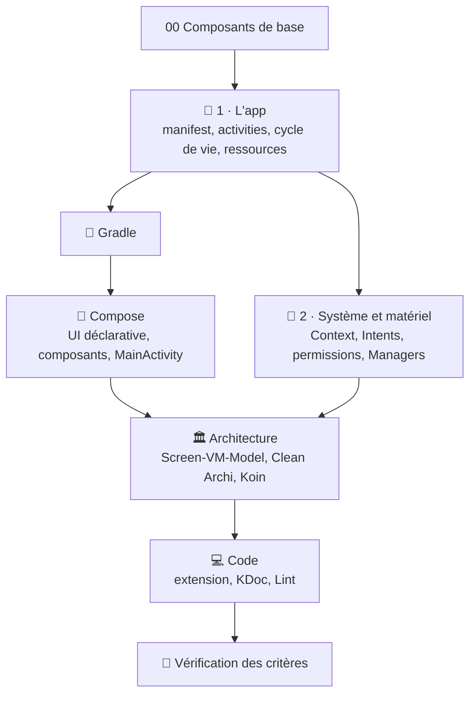

---
tags:
  - projet/kotlin
  - type/index
  - techno/kotlin
  - techno/android
  - statut/a-jour
aliases:
  - Kotlin / Android — MOC
  - Accueil Kotlin
cours: P1
cree: 2026-09-28
maj: 2026-10-27
---

# 🗂️ Kotlin / Android — MOC

> [!abstract] Map of Content
> Page d'accueil du cours **Kotlin / Android (P1)**. Point d'entrée vers toutes les notes.

## 🎯 Révision

- [[Grille P1 Mobile]] — les 16 critères de la grille, la note à relire pour chacun, et la checklist du rendu
- [[Vérification des critères]] — chaque point « Maîtrisé » à cocher, avec le lien vers la section qui l'explique

## 🧱 La base

- [[00 les composant de base]] — vue d'ensemble des composants
- **1 · L'app**
  - [[01 Le manifest]] — la carte d'identité de l'app
  - [[02 Les Activities]] — activities & contexte
  - [[03 Le cycle de vie]] — les 4 états, quoi faire à quelle étape, la rotation, la version Compose
  - [[04 Les Ressources]] — le répertoire `res` & la reconfiguration
    - [[4.1 Les ressources en pratique]] — `stringResource`, variantes (langue, nuit), nommage
  - [[05 Classes.dex]] — le code compilé / exécutable
  - [[06 Organisation du projet]] — les dossiers du projet et les packages par couche
- **2 · Système et matériel**
  - [[01 Le Context]] — le guichet vers le système, Application vs Activity
  - [[02 Les Intents]] — le message « je veux faire ça » envoyé à Android
  - [[03 Les Permissions]] — Android vérifie le manifest & les autorisations
  - [[04 Les capacités natives (Managers)]] — vibreur, capteurs, son… rangés dans des Managers
    - [[4.1 Le vibreur pas à pas]] — de A à Z, permission normale
    - [[4.2 La localisation pas à pas]] — de A à Z, permission dangereuse (popup)

## 🎨 Compose

- [[00 Compose]] — fonctions, philosophie Kotlin, métaphore Lego
- [[01 UI déclarative]] — l'UI en déclaratif : on décrit l'écran
- [[02 Les composants]] — card, row, column, image, text…
- [[03 Le modifier]] — configurer / décorer un composant
- [[04 MainActivity]] — construire `MainActivity.kt` étape par étape (Scaffold, NavHost, navbar)
- [[05 Les previews]] — `@Preview` : voir un composable sans lancer l'émulateur

## 💻 Code (mémo Kotlin)

- [[00 Code]] — index des sous-catégories
- [[01 Kotlin vs Java]] — pas d'accesseurs à coder, etc.
- [[02 Les classes]] — constructeur, membre vs paramètre
- [[03 Les logs]] — écrire/lire des logs, niveaux, bonnes pratiques
- [[01 Les notifications push]] — FCM, le token et la liaison avec un backend .NET
  - [[1.1 Notifications push côté Kotlin]] — le code Android pas à pas
  - [[1.2 Notifications push côté .NET]] — le code backend pas à pas
- [[04 Les fonctions d'extension]] — ajouter une fonction à `Context`, `Intent`…
- [[05 KDoc et commentaires]] — headers KDoc, block tags, manifest et Gradle commentés
- [[06 Conventions de nommage et Lint]] — nommer en Kotlin, chasser les warnings

## 🐘 Gradle

- [[00 Gradle]] — ce que fait Gradle, le réflexe « Sync Now »
- [[01 Les fichiers Gradle]] — la carte des fichiers `.gradle.kts` et du catalogue
- [[02 Ajouter une dépendance]] — ajouter une lib pas à pas (catalogue, BOM)
- [[03 Le bloc android]] — `namespace`, `minSdk`, `targetSdk`… ligne par ligne
- [[04 Commandes et erreurs Gradle]] — `gradlew` et les erreurs fréquentes

## 🏛️ Architecture

- [[00 Architecture]] — la Clean Architecture : UI, Domain, Data et la règle de dépendance
- [[01 Architecture (Screen - ViewModel - Model)]] — la version simple vue en cours
- [[02 La couche Domain]] — modèles, interfaces Repository, use cases
- [[03 La couche Data]] — Service/DTO, DAO/Entity, mapping, mécanisme de fetch
- [[04 La couche UI (MVI et UDF)]] — état, actions, flux unidirectionnel, Single Activity
- [[05 Koin (injection de dépendances)]] — l'outil qui branche les couches

## 🧭 Parcours conseillé

```mermaid
flowchart TD
    I[00 Composants de base] --> S1[🧱 1 · L'app<br/>manifest, activities, cycle de vie, ressources]
    S1 --> S2[🧱 2 · Système et matériel<br/>Context, Intents, permissions, Managers]
    S1 --> G[🐘 Gradle]
    G --> CP[🎨 Compose<br/>UI déclarative, composants, MainActivity]
    CP --> ARC[🏛️ Architecture<br/>Screen-VM-Model, Clean Archi, Koin]
    S2 --> ARC
    ARC --> CODE[💻 Code<br/>extension, KDoc, Lint]
    CODE --> GR[🎯 Vérification des critères]
```

## 🏷️ Tags du cours

Chaque note a au moins `#projet/kotlin`, un `#type/…` et un `#statut/…`.

| Famille | Tags utilisés ici |
|---|---|
| `techno/` | `#techno/kotlin` `#techno/android` `#techno/compose` `#techno/koin` `#techno/gradle` `#techno/java` `#techno/dotnet` `#techno/csharp` `#techno/efcore` |
| `sujet/` | `#sujet/apk` `#sujet/manifest` `#sujet/activity` `#sujet/cycle-de-vie` `#sujet/ressources` `#sujet/compilation` `#sujet/architecture` `#sujet/mvvm` `#sujet/ui` `#sujet/permissions` `#sujet/securite` `#sujet/injection-de-dependances` `#sujet/navigation` `#sujet/debug` `#sujet/build` `#sujet/dependances` `#sujet/notifications` `#sujet/clean-architecture` `#sujet/domain` `#sujet/data` `#sujet/mvi` `#sujet/etat` `#sujet/intent` `#sujet/context` `#sujet/capacites-natives` `#sujet/extension` `#sujet/documentation` `#sujet/conventions` `#sujet/qualite` `#sujet/evaluation` |
| `type/` | `#type/index` `#type/concept` `#type/guide` `#type/reference` |
| `statut/` | `#statut/a-jour` `#statut/brouillon` |
