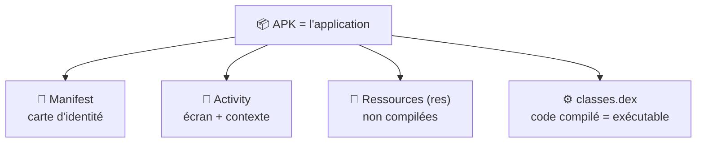
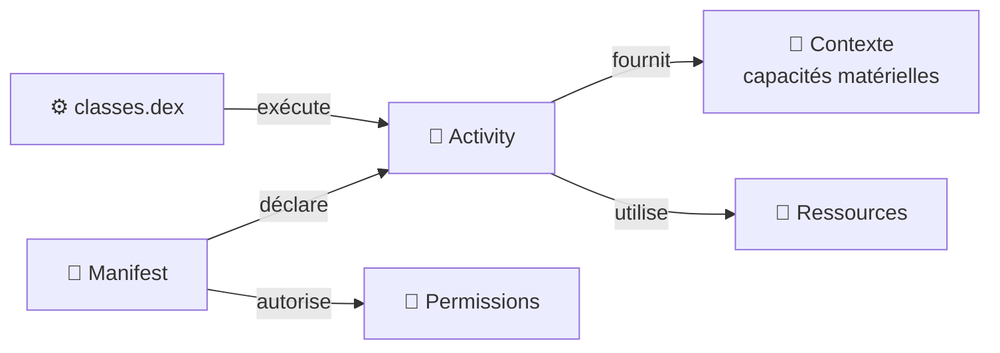

---
tags:
  - projet/kotlin
  - type/index
  - techno/kotlin
  - techno/android
  - sujet/apk
  - statut/a-jour
cours: P1
cree: 2026-09-28
maj: 2026-09-29
---

# Les composants de base d'une application Android

> [!abstract] En une phrase
> Une **application** Android est livrée sous forme d'**APK**. À l'intérieur de cet APK on trouve le **manifest**, les **activities** (+ leur contexte), les **ressources** et le **`classes.dex`** (le code compilé).

---

## 📦 À l'intérieur d'un APK (app)

| Composant | Rôle (résumé) | Note détaillée |
|---|---|---|
| **Manifest** | Carte d'identité : **nom de l'app**, **permissions** (ex. vibration), **activity principale** | [[01 Le manifest]] |
| **Activity** | Un **écran** ; fournit aussi un **contexte** (accès aux capacités matérielles) | [[02 Les Activities]] |
| **Ressources (`res`)** | **Non compilées** : images, sons, gifs, couleurs, strings (multilingue) | [[03 Les Ressources]] |
| **`classes.dex`** | Le **code compilé**, la **partie exécutable** de l'app | [[06 Classes.dex]] |

---

## 🧱 Autres notions

| Notion | Rôle | Note |
|---|---|---|
| **Cycle de vie** | Les états par lesquels passe une activity | [[02 Les Activities#Le cycle de vie d'une Activity]] |
| **Architecture** | Screen / ViewModel / Model | [[04 Architecture (Screen - ViewModel - Model)]] |
| **Permissions** | Ce que l'app a le droit de faire | [[05 Les Permissions]] |
| **UI déclarative** | L'UI décrite en déclaratif (plus du « compilé ») | [[07 UI déclarative]] |
| **Koin / DI** | Fournir les objets de l'extérieur (injection) | [[08 Koin (injection de dépendances)]] |

---

## 🔗 Comment ça s'articule

---

## ➡️ Suite

- [[01 Le manifest]]
- [[02 Les Activities]]
- [[03 Les Ressources]]
- [[04 Architecture (Screen - ViewModel - Model)]]
- [[05 Les Permissions]]
- [[06 Classes.dex]]
- [[07 UI déclarative]]
