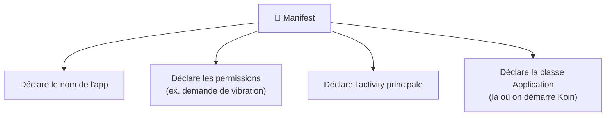

---
tags:
  - projet/kotlin
  - type/concept
  - techno/kotlin
  - techno/android
  - sujet/manifest
  - sujet/permissions
  - statut/a-jour
cours: P1
cree: 2026-09-28
maj: 2026-09-29
---

# Le manifest

> [!info] Définition
> Le **manifest** est la **carte d'identité de l'application**.

C'est le fichier que le système Android lit en premier : il décrit **ce qu'est** l'application et **ce qu'elle contient** avant même qu'elle ne se lance.

---

## 🧩 À quoi il sert

Le manifest **déclare l'app**, c'est-à-dire :

- le **nom de l'app** ;
- les **permissions** (exemple : **demande de vibration**) ;
- l'**[[02 Les Activities|activity principale]]** (le point d'entrée de l'app) ;
- la classe **`Application`** de l'app, s'il y en a une (`android:name`). C'est souvent là qu'on démarre l'**[[08 Koin (injection de dépendances)|injection de dépendances]]**.

> [!warning] Les libs ne sont pas dans le manifest
> Les **libs** (Compose, Koin, Ktor…) se déclarent dans **Gradle**, dans `app/build.gradle.kts` → [[02 Ajouter une dépendance]]. Le manifest, lui, déclare ce que l'app **est** et ce qu'elle a **le droit de faire**.

---

## Point d'attention injection de dépendances

> [!warning] Le purgatoire tue tout
> Si dans une activity on déclare des libs **avec injection de dépendances**, et que l'app est envoyée au **purgatoire**, alors **toutes les activities se font tuer**.

C'est un effet direct du [[02 Les Activities#Le cycle de vie d'une Activity|cycle de vie]] : le passage au purgatoire peut détruire le contexte, donc les dépendances injectées. L'outil d'injection utilisé est [[08 Koin (injection de dépendances)|Koin]].

---

## 🔐 Il déclare aussi les permissions

Le manifest **déclare** ce que l'app a le droit de faire (jouer un son, ouvrir la caméra…). Ce n'est **pas lui le gardien** : c'est **Android** qui, au moment d'agir, **vérifie le manifest**.

👉 Détail dans [[05 Les Permissions]].

---

## 🔗 Liens

- [[00 les composant de base]]
- [[02 Les Activities]]
- [[05 Les Permissions]]
