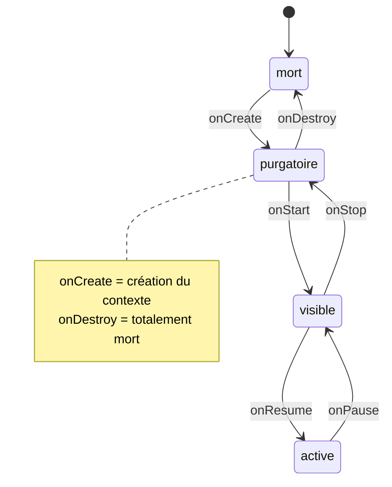

---
tags:
  - projet/kotlin
  - type/concept
  - techno/kotlin
  - techno/android
  - sujet/activity
  - sujet/cycle-de-vie
  - statut/a-jour
cours: P1
cree: 2026-09-28
maj: 2026-09-29
---

# Les Activities

> [!info] Définition
> **Kotlin (Android) fonctionne avec des activities.** Une activity est une **unité de l'application** : en gros, un **écran**.

Chaque activity est déclarée dans [[01 Le manifest|le manifest]], tourne dans un [[#Le contexte|contexte]] et traverse un [[#Le cycle de vie d'une Activity|cycle de vie]].

---

## Le contexte

> [!info] Définition
> Le **contexte** est la **classe de base d'Android** qui fournit les **contrats** permettant d'**accéder aux capacités matérielles du téléphone** (par exemple **vibrer**).

Une **activity est aussi un contexte**. C'est par lui qu'on accède aux ressources et capacités du système (vibration, notifications, fichiers, services…). Le contexte est **créé** au lancement de l'activity (étape `onCreate`) et **détruit** à sa mort.

> [!warning] Lien avec l'injection de dépendances
> Comme les dépendances injectées reposent sur le contexte, le passage au **purgatoire** qui détruit le contexte fait **tuer les activities**. → voir [[01 Le manifest#Point d'attention injection de dépendances]]

---

## Le cycle de vie d'une Activity

Une activity passe par **4 états** reliés par des **méthodes de callback** (`onCreate`, `onStart`…).

### 🧭 Les 4 états

| État | Description |
|---|---|
| **mort** | L'activity n'existe pas (ou plus). |
| **purgatoire** | Elle est « morte » mais **survit légèrement** : elle peut encore envoyer des notifications et **garder un certain contexte**. |
| **visible** | Elle est affichée mais **pas au premier plan** (ex. masquée partiellement). |
| **active** | Elle est **au premier plan**, l'utilisateur interagit avec. |

### 🔁 Diagramme d'états

### 📋 Les transitions en détail

| Transition | Méthode | Ce qui se passe |
|---|---|---|
| mort → purgatoire | `onCreate` | **Création du contexte**. |
| purgatoire → visible | `onStart` | L'activity devient visible. |
| visible → active | `onResume` | L'activity passe au premier plan. |
| active → visible | `onPause` | L'activity quitte le premier plan. |
| visible → purgatoire | `onStop` | L'activity n'est plus visible. |
| purgatoire → mort | `onDestroy` | L'activity est **totalement morte**. |

> [!note] Lecture du schéma
> L'entrée se fait toujours « vers le haut » (`onCreate → onStart → onResume`) et la sortie « vers le bas » (`onPause → onStop → onDestroy`). Le **purgatoire** est l'état intermédiaire : l'app n'est plus visible mais pas encore détruite.

> [!tip] Reconfiguration = cycle complet
> Un changement de configuration (ex. **mode jour → mode nuit**) relance **tout** le cycle : suppression entière puis création entière. → voir [[03 Les Ressources#Reconfiguration cycle de vie complet]]

---

## 🔗 Liens

- [[00 les composant de base]]
- [[01 Le manifest]]
- [[03 MainActivity]] — créer sa MainActivity en pratique
