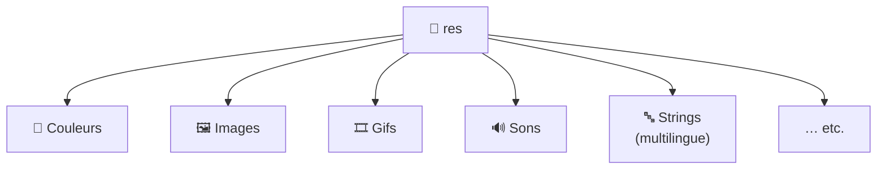
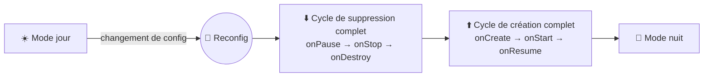

---
tags:
  - projet/kotlin
  - type/concept
  - techno/kotlin
  - techno/android
  - sujet/ressources
  - statut/a-jour
cours: P1
cree: 2026-09-28
maj: 2026-09-29
---

# Les Ressources (`res`)

> [!info] Définition
> Le répertoire **`res`** (ressources) contient tout ce qui n'est **pas du code** mais qui sert à l'application.

---

## 🗂️ Ce qu'on peut créer dans `res`

On peut y créer une ressource :

- une **couleur** (en XML) ;
- des **images** ;
- des **gifs** ;
- des **sons** ;
- des **strings** (chaînes de caractères) → pour le **multilingue** généralement ;
- etc.

---

## 🎯 Ressources conditionnelles (qualifiers)

> [!tip] Ressource selon la configuration
> On peut définir un fichier `res` qui ne sera utilisé **que dans certains cas** — par exemple **uniquement quand le téléphone est en mode nuit et que le clavier est caché**.

Android choisit automatiquement la bonne ressource selon la configuration du téléphone (mode jour/nuit, langue, orientation, clavier…).

---

## ⚙️ Ressources non compilées

> [!note] Pas compilées, mais embarquées
> Ce sont des ressources qui **ne sont pas compilées**. Elles **vivent dans le répertoire de l'APK**, parce qu'on considère qu'elles sont **liées au système**.

---

## Reconfiguration cycle de vie complet

> [!warning] Changer de config relance tout le cycle de vie
> Quand on change du **mode jour au mode nuit**, Android considère ça comme une **reconfiguration de l'application**.
> On passe alors par le **cycle de suppression en entier**, puis on **repasse par le cycle de création en entier**.

👉 Voir le détail des états et méthodes dans [[02 Les Activities#Le cycle de vie d'une Activity]].

---

## 🔗 Liens

- [[00 les composant de base]]
- [[02 Les Activities]]
