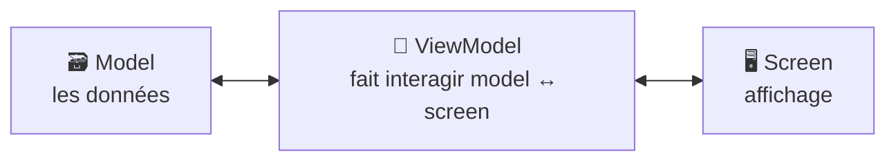
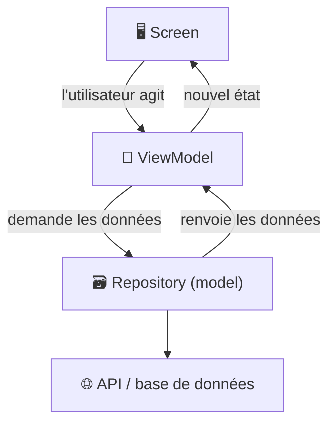

---
tags:
  - projet/kotlin
  - type/concept
  - techno/kotlin
  - techno/android
  - sujet/architecture
  - sujet/mvvm
  - statut/a-jour
cours: P1
cree: 2026-09-28
maj: 2026-09-29
---

# Architecture : Screen – ViewModel – Model

> [!abstract] En une phrase
> Trois couches : le **screen** affiche, le **view model** fait le lien, le **model** porte les données.

---

## 🧩 Les 3 couches

| Couche | Rôle |
|---|---|
| **screen** | affichage *(tes mots)* |
| **view model** | permet de faire interagir les models avec le screen *(tes mots)* |
| **model** | les **données** de l'app, et le code qui va les **chercher** (API, base de données) |

---

## 🔁 Comment elles communiquent

- Le **screen** ne parle pas directement au **model** : il passe par le **view model**.
- Le **view model** est l'intermédiaire qui **fait interagir les models avec le screen**.

---

## 🗃️ La couche Model en détail

> [!note] Complété le 29 septembre 2026
> Cette partie n'était pas dans tes notes de cours (`..`). À comparer avec le cours si le prof a donné une autre définition.

Le **model**, c'est **ce que l'app manipule**, sans rien savoir de l'affichage. On y trouve en général :

| Élément | Rôle | Exemple |
|---|---|---|
| **Data class** | Décrit **une donnée** | `data class Host(val id: Int, val name: String)` |
| **Repository** | **Va chercher** les données et les rend au ViewModel. Le ViewModel ne sait pas d'où elles viennent | `HostRepository.getHosts()` |
| **Source de données** | L'endroit réel où sont les données : une **API** (avec Ktor), une **base locale**… | un appel HTTP |

> [!tip] Pourquoi séparer
> Si demain les données viennent d'une autre API, on ne change que le **repository**. Le ViewModel et le Screen ne bougent pas.

---

## 🔗 Liens

- [[00 les composant de base]]
- [[02 Les Activities]]
