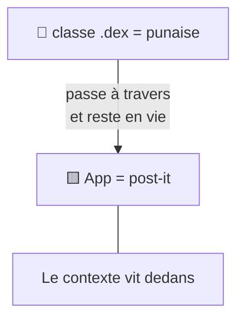
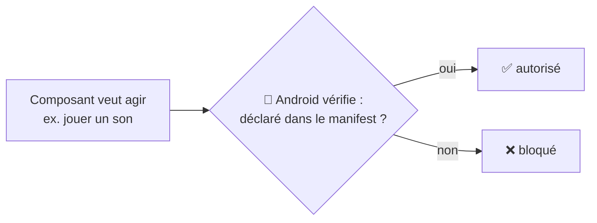
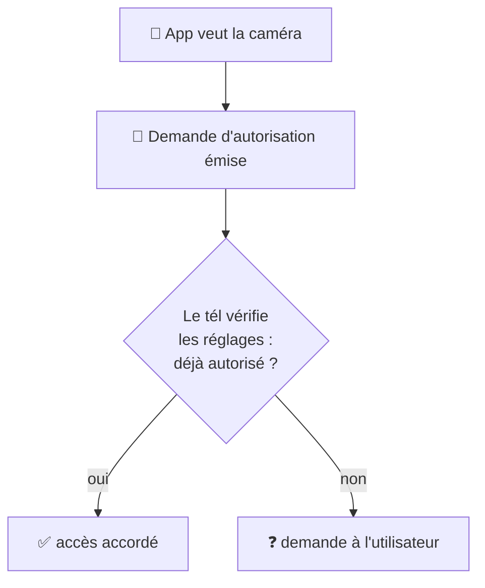

---
tags:
  - projet/kotlin
  - type/concept
  - techno/kotlin
  - techno/android
  - sujet/permissions
  - sujet/securite
  - statut/a-jour
cours: P1
cree: 2026-09-28
maj: 2026-09-29
---

# Les Permissions

> [!abstract] Idée clé
> Pour qu'un composant ait le droit de **faire quelque chose** (jouer un son, ouvrir la caméra…), il faut que ce soit **déclaré dans le [[01 Le manifest|manifest]]**. C'est **Android** (le gardien) qui **vérifie le manifest** et bloque si ce n'est pas déclaré.
>
> ⚠️ Le manifest n'est **pas** le gardien : c'est la **carte d'identité** qui *déclare*. Le **gardien, c'est le système Android**.

---

## 🪧 La métaphore : post-it & punaise

> [!quote] Tes mots
> Le **contexte vit dans l'application** ; on peut dire que l'**app est un post-it**.
> Mais la **classe `.dex`**, elle, est une **punaise** : elle **passe à travers** et **reste en vie** du coup.

> [!note] Rappel
> Techniquement, **`classes.dex`** est le **code compilé / la partie exécutable** de l'app (voir [[06 Classes.dex]]). La « punaise » est la **métaphore de cours** pour dire qu'il s'exécute et veut accéder aux capacités du tél.

---

## 🚪 Le gardien (Android) : déclaré ou bloqué

> [!quote] Tes mots
> Quand la **classe `.dex` veut sortir** — exemple **jouer un son** — *hop*, il y a un **gardien**. S'il **n'est pas déclaré dans le manifest**, alors *hop* **on le détruit**, rien à faire.

👉 Le **gardien, c'est Android** : il **regarde le manifest**. Ce qui n'y est **pas déclaré** n'a pas le droit de sortir.

---

## 🦠 Deux types de permissions

### 1. Permissions « simples » (ex. jouer un son)

> [!quote] Tes mots
> C'est un peu comme le **covid** : on doit **demander autorisation**, comme pour jouer un son… alors qu'**il n'y a pas de popup** pour jouer du son. « Alors c'est con. »

➡️ Déclarées dans le manifest, mais **sans popup** à l'utilisateur.

### 2. Permissions **invasives** (caméra, micro, localisation…)

> [!quote] Tes mots
> Il y a aussi celles qui sont **invasives** comme **caméra, micro, localisation** etc.
> Exemple : l'app veut ouvrir la caméra → une sorte d'**alarme** se déclenche. Cette fois c'est une **demande d'autorisation**.

Déroulé de la demande :

- Une **demande d'autorisation** est émise.
- Le **téléphone vérifie dans les réglages** si l'utilisateur l'a **déjà autorisé ou non**.
- **Si non** → il **demande à l'utilisateur**.

---

## ⛓️ Pas déclaré = bloqué

> [!quote] Tes mots
> Pas déclaré → « **prison android le pète, il en a rien à battre** ».

➡️ Si ce n'est **pas déclaré dans le manifest**, Android **ne laisse pas faire** (composant bloqué / tué).

---

## 🔗 Liens

- [[01 Le manifest]] — où se déclarent les permissions
- [[02 Les Activities#Le cycle de vie d'une Activity]] — la destruction des composants
- [[00 les composant de base]]
