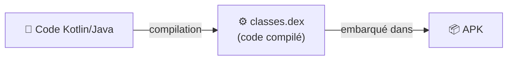

---
tags:
  - projet/kotlin
  - type/concept
  - techno/kotlin
  - techno/android
  - sujet/compilation
  - statut/a-jour
cours: P1
cree: 2026-09-28
maj: 2026-09-29
---

# `classes.dex`

> [!info] Définition
> **`classes.dex`** contient le **code compilé**. C'est la **partie exécutable** de l'application.

---

## 📦 Sa place dans l'APK

- On écrit du **code** (Kotlin / Java).
- La **compilation** produit le **`classes.dex`**.
- C'est ce `.dex` qui est **exécuté** par le téléphone → la **partie exécutable** de l'app.

---

## 🆚 Par rapport aux ressources

> [!tip] Compilé vs non compilé
> - **`classes.dex`** = le code, **compilé** et **exécutable**.
> - Les **[[03 Les Ressources|ressources (`res`)]]** = **non compilées** (images, sons, gifs, couleurs, strings).

---

## 🔗 Liens

- [[00 les composant de base]]
- [[03 Les Ressources]]
- [[05 Les Permissions]]
