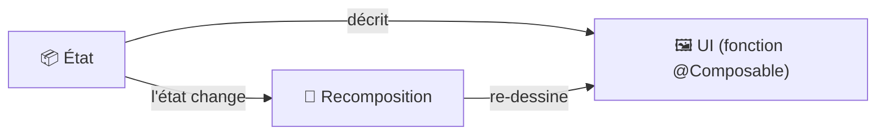

---
tags:
  - projet/kotlin
  - type/concept
  - techno/kotlin
  - techno/android
  - techno/compose
  - sujet/ui
  - statut/brouillon
cours: P1
cree: 2026-09-28
maj: 2026-09-29
---

# L'UI déclarative

> [!info] Idée clé
> La partie **UI est désormais du déclaratif** — ce n'est plus l'ancienne approche « compilée » (layouts XML inflatés).

> [!question] À confirmer
> Tu avais noté « **UI pacest** » : je l'interprète comme **Jetpack Compose** (le toolkit d'UI déclarative de Kotlin/Android). À confirmer avec le cours — dis-moi si le terme exact était autre chose.

---

## 🆚 Déclaratif vs impératif

| Approche | Comment on décrit l'UI |
|---|---|
| **Impératif** (ancien, XML + vues) | On crée des vues, puis on les **modifie à la main** quand l'état change (`textView.setText(...)`). |
| **Déclaratif** (Compose) | On **décrit** à quoi l'UI doit ressembler **pour un état donné** ; quand l'état change, le framework **re-dessine** tout seul. |

---

## 🧠 À retenir

- On **déclare** l'UI en fonction d'un **état**, au lieu de manipuler les vues une par une.
- Quand l'**état change**, l'UI est **recalculée / re-dessinée** automatiquement (la « recomposition »).
- Ça s'articule bien avec l'architecture [[04 Architecture (Screen - ViewModel - Model)|Screen / ViewModel / Model]] : le **ViewModel** porte l'**état**, le **Screen** le **déclare**.

---

## 🔗 Liens

- [[00 les composant de base]]
- [[04 Architecture (Screen - ViewModel - Model)]]
