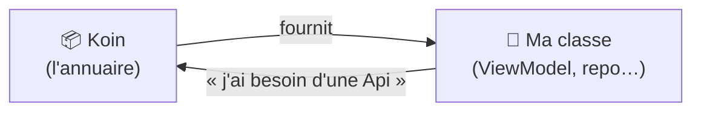

---
tags:
  - projet/kotlin
  - type/concept
  - techno/kotlin
  - techno/android
  - techno/koin
  - sujet/injection-de-dependances
  - statut/a-jour
cours: P1
cree: 2026-09-28
maj: 2026-09-29
---

# Koin (injection de dépendances)

> [!abstract] En une phrase
> **Koin** est une **bibliothèque** qui fait l'**injection de dépendances (DI)** : au lieu que chaque classe **fabrique elle-même** les objets dont elle a besoin, on les lui **fournit** de l'extérieur.

---

## 🧠 C'est quoi l'injection de dépendances (simplement)

> [!example] Sans DI vs avec DI
> - **Sans DI** : ma classe fait `val api = Api()` elle-même → elle est **collée** à `Api`.
> - **Avec DI** : on **donne** l'`Api` à ma classe toute prête → elle ne sait pas comment elle est fabriquée, elle s'en sert juste.



👉 C'est comme un **annuaire / une caisse à outils** : on déclare **une seule fois** comment fabriquer chaque objet, puis on le **demande** quand on en a besoin.

---

## 🧰 Comment on s'en sert (les 3 mots à connaître)

| Mot | Ce que ça veut dire |
|---|---|
| **`module`** | L'endroit où on **déclare** les recettes (« voilà comment fabriquer X ») |
| **`single`** | **Un seul** exemplaire partagé partout (singleton) |
| **`factory`** | Un **nouvel** exemplaire à **chaque** demande |

```kotlin
// 1) On déclare les recettes dans un module
val appModule = module {
    single { Api() }                 // un seul Api pour toute l'app
    factory { Repository(get()) }    // get() = "donne-moi l'Api déjà déclarée"
}

// 2) On demande l'objet là où on en a besoin
val repo: Repository by inject()
```

> [!tip] `get()` et `inject()`
> - **`get()`** : « va chercher dans l'annuaire l'objet dont j'ai besoin ».
> - **`inject()`** : pareil, mais **paresseux** (l'objet n'est créé qu'au moment où on l'utilise).

---

## 🔗 Lien avec le reste du cours

> [!warning] Rappel cycle de vie
> Si des dépendances sont injectées au niveau d'une [[02 Les Activities|activity]] et que l'app part au **purgatoire**, les activities (et leur contexte) peuvent être **tuées** → voir [[01 Le manifest#Point d'attention injection de dépendances]].

- Très utilisé pour fournir les **ViewModel** → voir [[04 Architecture (Screen - ViewModel - Model)]].

---

## 🔗 Liens

- [[00 les composant de base]]
- [[01 Le manifest]]
- [[04 Architecture (Screen - ViewModel - Model)]]
- [[02 Ajouter une dépendance]] — ajouter Koin au projet (Gradle + BOM)
