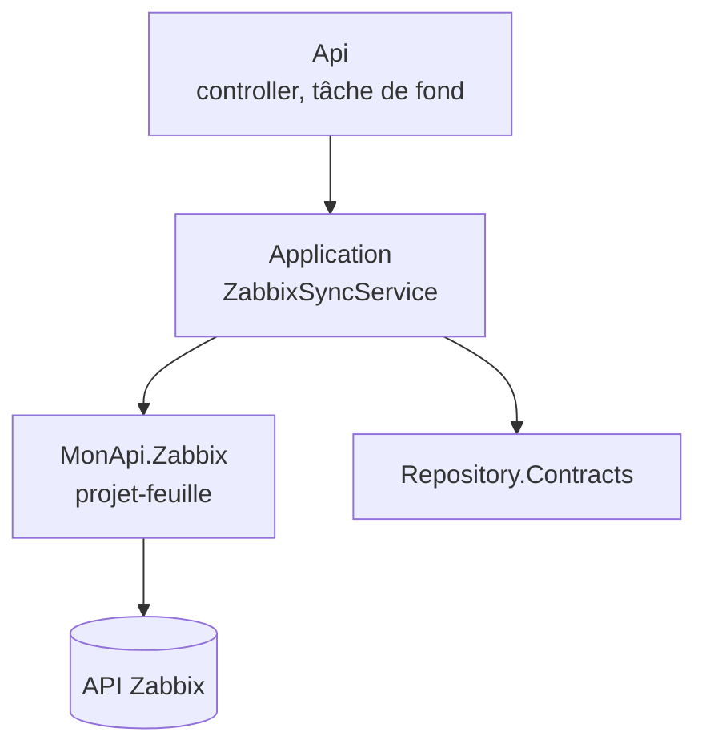

---
tags:
  - projet/csharp
  - type/index
  - techno/csharp
  - techno/dotnet
  - sujet/api-tierce
  - sujet/architecture
  - statut/a-jour
aliases:
  - CSharp — API tierces
  - Intégrer une API externe
cree: 2026-09-30
maj: 2026-09-30
---

# API tierces

> [!abstract] En une phrase
> Une **API tierce** est un service externe que notre API appelle (un outil de supervision, un paiement, un envoi de mails…). On range son client dans un **projet-feuille** dédié, on l'appelle avec un **client HTTP typé**, et on choisit entre **l'appeler à chaque requête** ou **copier ses données** dans notre base. À lire avant : [[01 Clean architecture en couches]].

---

## 🍃 Un projet-feuille par API tierce

Comme `MonApi.Security`, le client d'une API tierce vit dans **son propre projet**, qui ne référence **aucun** autre projet de la solution.

```
MonApi.Zabbix/                       # projet-feuille : aucune référence MonApi
├── IZabbixClient.cs                 # l'interface utilisée par Application
├── ZabbixApiClient.cs               # internal : l'implémentation HTTP
├── ZabbixOptions.cs                 # URL, token, timeout (pattern Options)
├── ZabbixException.cs               # une seule exception pour « indisponible »
├── Models/                          # ses propres modèles (ZabbixHost, ZabbixProblem…)
├── JsonRpc/                         # internal : le JSON brut du service
└── DependencyInjection.cs           # AddZabbix(configuration)
```

| Choix | Pourquoi |
|---|---|
| Projet-feuille | Le client est une brique **technique** : il ne connaît ni les entités, ni la base. On peut le tester seul et le remplacer |
| **Ses propres modèles** | Comme `TokenPayload` dans `Security` : le client renvoie `ZabbixHost`, pas une entité du Domain |
| JSON brut en `internal` | Les champs bizarres du service (`"r_clock"`, `"key_"`, les nombres envoyés en texte) ne sortent jamais du projet |
| Une exception dédiée | Le reste de l'appli n'a qu'une chose à attraper : « le service est indisponible » |

Le cas d'usage qui **utilise** ces données (synchroniser, afficher) reste dans `Application`, qui référence ce projet :



---

## 🔐 Les règles communes

- **Client HTTP typé** (`AddHttpClient<IZabbixClient, ZabbixApiClient>`), jamais de `new HttpClient()`, voir [[02 Injection de dépendances en .NET]].
- **Un timeout** configuré : ne jamais attendre le service indéfiniment.
- **Le token** dans les user-secrets ou dans le `.env`, envoyé dans un header, **jamais écrit dans un log ni dans un message d'erreur**, voir [[02 Garder les secrets hors du repo]].
- **Réglages facultatifs** : sans token, l'appli démarre quand même et la fonctionnalité se désactive.
- **Tests** avec un faux serveur HTTP, voir [[01 Tester sans dépendances externes]].

---

## ⚖️ Appeler en direct ou synchroniser ?

| | Appel direct (proxy) | Synchronisation dans notre base |
|---|---|---|
| Principe | Chaque requête du front appelle le service | Une tâche de fond copie le service toutes les N secondes |
| Fraîcheur | Temps réel | Jusqu'à N secondes de décalage |
| Nombre d'appels au service | **Proportionnel au trafic** du front | **Un lot fixe** toutes les N secondes |
| Service en panne | Notre API ne répond plus | On sert les dernières données connues |
| Historique | Limité à ce que garde le service | On garde le nôtre |
| Complexité | Simple | Upsert, gestion des disparitions |

> [!tip] Comment choisir
> - Données **lues souvent**, service **lent ou fragile**, besoin d'**historique** → **synchronisation**.
> - Donnée **rare** et qui doit être **exacte à la seconde** (un solde, un paiement) → **appel direct**.

---

## 📚 Les API tierces documentées

| API | Notes |
|---|---|
| **Zabbix** (supervision) | [[00 Zabbix]] |

---

## 🔗 Liens

- [[csharp]] — accueil du vault
- [[04 Tâches de fond (BackgroundService)]] — la boucle de synchronisation
- [[03 Synchroniser des données externes (upsert)]] — copier sans doublon
