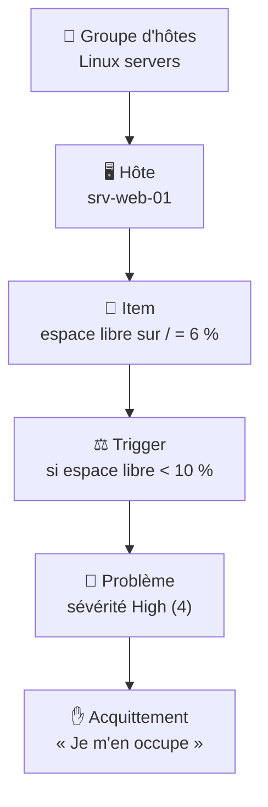

---
tags:
  - projet/csharp
  - type/concept
  - techno/zabbix
  - sujet/supervision
  - sujet/api-tierce
  - statut/a-jour
aliases:
  - Zabbix — vocabulaire
cree: 2026-09-30
maj: 2026-10-01
---

# Zabbix — les concepts

> [!abstract] En une phrase
> Zabbix **mesure** des valeurs sur des machines (les **items**), les **compare** à des règles (les **triggers**) et **ouvre un problème** quand une règle est franchie. Des humains peuvent ensuite **acquitter** ce problème. À lire avant : [[00 Zabbix]].

---

## 🧩 La chaîne complète, sur un exemple

| Notion | Ce que c'est | Exemple |
|---|---|---|
| **Groupe d'hôtes** (`hostgroup`) | Un dossier pour ranger les machines. **Une machine peut être dans plusieurs groupes** | *Linux servers*, *Virtual machines* |
| **Hôte** (`host`) | Une machine surveillée, en général par un **agent Zabbix** installé dessus. `status` : 0 = surveillé, 1 = désactivé | `srv-web-01` |
| **Item** | **Une mesure** sur un hôte, identifiée par une **clé** | `vfs.fs.size[/,pfree]` = 6 % |
| **Trigger** | **Une règle** posée sur un ou plusieurs items, avec une sévérité | `last(/srv-web-01/vfs.fs.size[/,pfree])<10` |
| **Problème** (*event*) | **Le moment où la règle se déclenche.** Début `clock`, fin `r_clock` (0 tant qu'il est actif) | Événement 867, *High* |
| **Acquittement** (`acknowledge`) | **Une action humaine** sur un problème : prise en charge, message, changement de sévérité, fermeture | « Je m'en occupe » |

> [!example] Le détecteur de fumée
> L'**item**, c'est le capteur qui mesure la fumée. Le **trigger**, c'est la règle « au-delà de tel seuil, ça sonne ». Le **problème**, c'est l'alarme qui sonne à 14 h 32. L'**acquittement**, c'est quelqu'un qui appuie sur le bouton en disant « je vais voir ».

---

## 🌡️ La sévérité

| Valeur | Nom |
|---|---|
| 0 | Not classified |
| 1 | Information |
| 2 | Warning |
| 3 | Average |
| 4 | High |
| 5 | Disaster |

👉 On la garde telle quelle (un entier de 0 à 5) dans notre base.

---

## 🧱 Les templates

Un **template** est un modèle d'items et de triggers qu'on applique à un hôte. *Linux by Zabbix agent* ajoute d'un coup le CPU, la RAM, les disques et leurs règles.

> [!warning] Les clés changent d'un template à l'autre
> La RAM s'appelle `vm.memory.utilization` sous Linux, `vm.memory.util` sous Windows, et d'autres templates utilisent `vm.memory.size[pavailable]` (ce qui est **libre**, pas ce qui est utilisé). Le jour où on lira des mesures, il faudra donc prévoir **plusieurs clés possibles** par ressource.

---

## ⚠️ Le piège de vocabulaire

> [!warning] Une « alert » Zabbix n'est pas une alerte au sens courant
> Dans Zabbix, une **alert** est une **notification envoyée** (mail, Teams…) par une **action**. Ce qu'on appelle couramment une « alerte » correspond au **problème**. On lit donc les problèmes (`problem.get`), pas les alerts (`alert.get`).

---

## 🔗 Liens

- [[02 Zabbix — l'API JSON-RPC]] — lire ces objets depuis C#
- [[03 Zabbix — synchroniser dans sa base]] — à quoi chaque notion correspond dans notre base
- [[04 Zabbix — pièges et limites]] — les faux positifs
