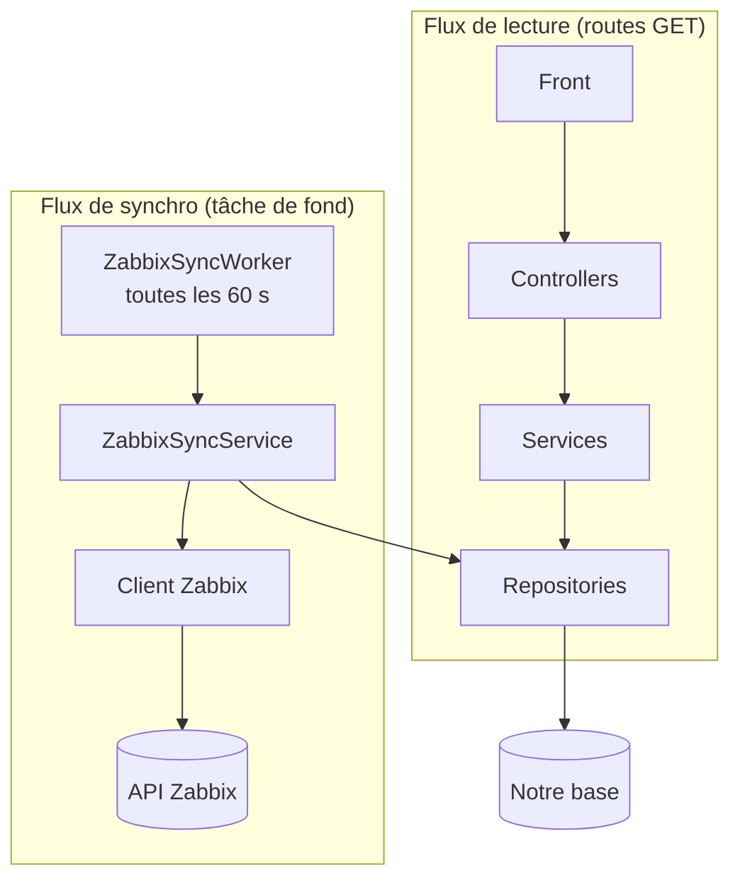
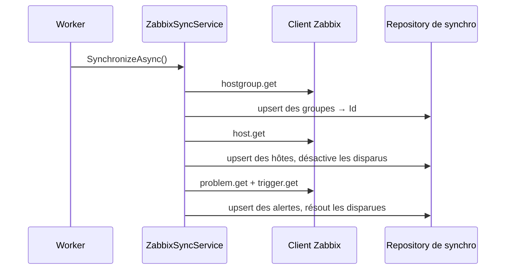

---
tags:
  - projet/csharp
  - type/archi
  - techno/zabbix
  - techno/dotnet
  - techno/efcore
  - sujet/api-tierce
  - sujet/synchronisation
  - sujet/architecture
  - statut/a-jour
aliases:
  - Synchro Zabbix
cree: 2026-09-30
maj: 2026-10-01
---

# Zabbix — synchroniser dans sa base

> [!abstract] En une phrase
> Plutôt que d'appeler Zabbix à chaque requête du front, une **tâche de fond** copie dans notre base, toutes les 60 secondes, les **groupes d'hôtes**, les **hôtes** et les **alertes** de Zabbix. Les routes `GET` de l'API ne lisent que notre base. À lire avant : [[02 Zabbix — l'API JSON-RPC]].

---

## ⚖️ Pourquoi synchroniser

Deux options ont été comparées, voir [[00 API tierces]] :



**Décision : la synchronisation.**

| Argument | Détail |
|---|---|
| Le front ne dépend pas de Zabbix | Zabbix en panne → on sert les dernières données connues |
| Moins d'appels à Zabbix | 4 appels au plus toutes les 60 s, au lieu de plusieurs appels **par requête du front** |
| Pas de doublons | Chaque objet est retrouvé grâce à son identifiant Zabbix (upsert) |
| Plus rapide pour le front | Il lit la base locale, sans attendre le réseau |
| Coût | Jusqu'à 60 s de décalage, et du code de synchro à maintenir |

> [!warning] L'intuition trompeuse
> On pense souvent que copier crée plus de requêtes, des doublons et de la lenteur. C'est l'inverse : c'est l'**appel direct** qui multiplie les requêtes et fait attendre le front. Les doublons sont évités par l'upsert.

---

## 🔗 Ce qui est récupéré

| Zabbix | Notre entité | Champs |
|---|---|---|
| Groupe d'hôtes | `GroupHost` | `groupid` → `ExternalId`, `name` |
| Hôte | `Host` | `hostid` → `ExternalId`, `name`, `description`, `status = 1` → `IsDisabled`, **premier groupe** → `GroupHostId` |
| Problème | `Alert` | `eventid` → `ExternalId`, `name` → `Subject`, `opdata` → `Message`, `severity`, `clock` → `DateTime`, `r_clock` → `ResolvedAt`, hôte du trigger → `HostId` |

Le détail de chaque appel est dans [[05 Zabbix — les méthodes utilisées]].

| Décision | Pourquoi |
|---|---|
| Un hôte n'a qu'**un** groupe : on garde le premier (identifiant le plus petit) | Garder un modèle simple |
| Un objet disparu n'est **jamais supprimé** | Hôte → `IsDisabled = true`, problème → `ResolvedAt` renseigné. On garde l'historique |
| Textes tronqués à la longueur des colonnes | Un nom Zabbix peut être plus long que la colonne |
| Pas de données de démo quand on utilise Zabbix | Le seed lit un booléen de config (`Seed:SampleData`) : à `false`, il ne crée que le compte admin, sans faux hôtes mélangés aux vrais |

> [!info] Pas récupéré pour l'instant
> Les **acquittements** (suivi humain des alertes) et les **mesures** CPU / RAM / disque (`item.get`) ne sont pas synchronisés. Ce sont des pistes pour plus tard.

---

## 🔁 L'ordre d'une synchronisation

L'ordre suit les **clés étrangères** : impossible de relier une alerte à un hôte qui n'existe pas encore.



👉 Chaque upsert renvoie la correspondance `ExternalId → Id` : c'est elle qui permet de remplir `GroupHostId` sur les hôtes, puis `HostId` sur les alertes. Voir [[03 Synchroniser des données externes (upsert)]].

---

## 🗂️ Où ranger chaque fichier

| Projet | Fichiers |
|---|---|
| `MonApi.Zabbix` (projet-feuille) | `IZabbixClient`, `ZabbixApiClient`, `ZabbixOptions`, `ZabbixException`, `Models/`, `JsonRpc/` |
| `MonApi.Domain` | `Monitoring/Host`, `GroupHost`, `Alert`, avec leur colonne `ExternalId` et l'interface `IExternalEntity` |
| `MonApi.EntitiesContext` | Les configurations (index unique filtré sur `ExternalId`) et la migration |
| `MonApi.Repository.Contracts` / `Repository` | `IExternalSyncRepository` / `ExternalSyncRepository` : les upserts, `DisableHostsExceptAsync`, `ResolveAlertsExceptAsync`. Aucun nom « Zabbix » ici |
| `MonApi.Application.Contracts` | `Monitoring/IZabbixSyncService` |
| `MonApi.Application` | `Monitoring/ZabbixSyncService` : lit, traduit, enregistre |
| `MonApi.Api` | `ZabbixSyncWorker` (la tâche de fond) et `ZabbixSyncOptions` (ses réglages) |

> [!tip] Les réglages de la boucle restent dans l'Api
> « Synchro activée ? » et « toutes les combien de secondes ? » ne concernent que la tâche de fond. Ils sont rangés à côté d'elle, dans l'Api : aucune couche intérieure n'a besoin de les connaître.

---

## ⚙️ Les réglages

```json
"Seed": {
  "SampleData": false
},
"Zabbix": {
  "Url": "",
  "ApiToken": "",
  "TimeoutSeconds": 30,
  "Sync": {
    "Enabled": true,
    "IntervalSeconds": 60
  }
}
```

| Réglage | Rôle |
|---|---|
| `Url`, `ApiToken` | Vides dans le fichier versionné : ils viennent des user-secrets ou du `.env`. Sans eux, la synchro est ignorée et l'API démarre quand même |
| `TimeoutSeconds` | Temps d'attente maximum d'une réponse de Zabbix |
| `Sync:Enabled` | Coupe la synchro sans toucher au code |
| `Sync:IntervalSeconds` | **Toutes les combien on lit Zabbix** (10 s au minimum) : c'est la fraîcheur des données |
| `Seed:SampleData` | `true` pour avoir des données de démo quand on n'a pas accès à Zabbix |

---

> [!todo] À compléter
> - [ ] Les routes POST / PUT / DELETE de `Host`, `GroupHost` et `Alert` : une modification d'une donnée venue de Zabbix est écrasée à la synchro suivante. Plus tard, l'envoyer à Zabbix (`host.update`, `event.acknowledge`…) ou la refuser (`409 Conflict`).
> - [ ] Synchroniser les acquittements et les mesures, si besoin.

---

## 🔗 Liens

- [[05 Zabbix — les méthodes utilisées]] — les appels à Zabbix en détail
- [[04 Tâches de fond (BackgroundService)]] — la boucle toutes les 60 s
- [[03 Synchroniser des données externes (upsert)]] — l'upsert en détail
