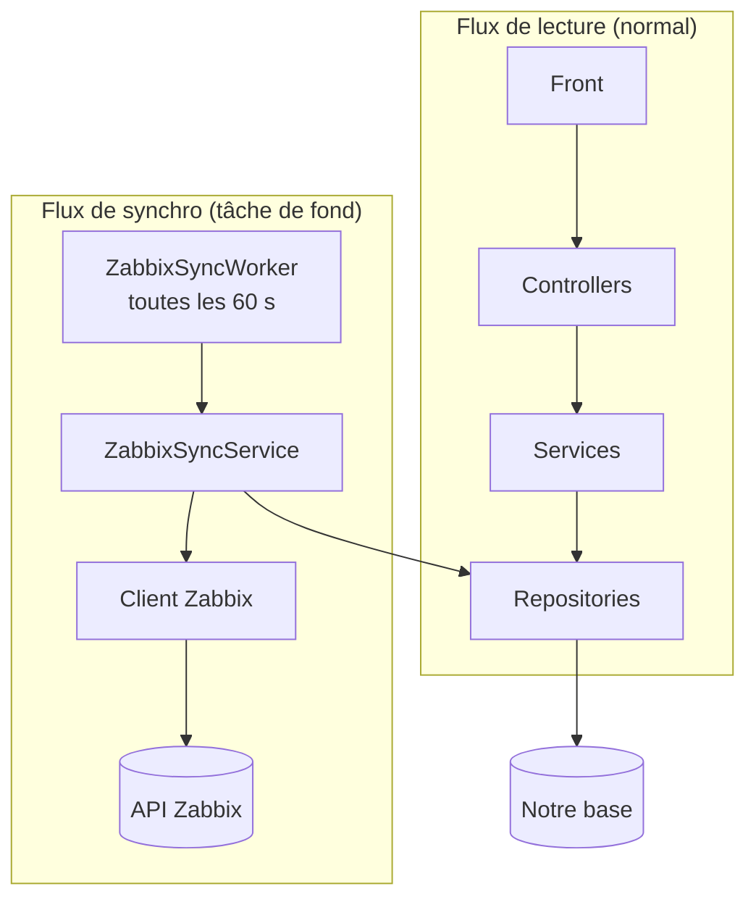
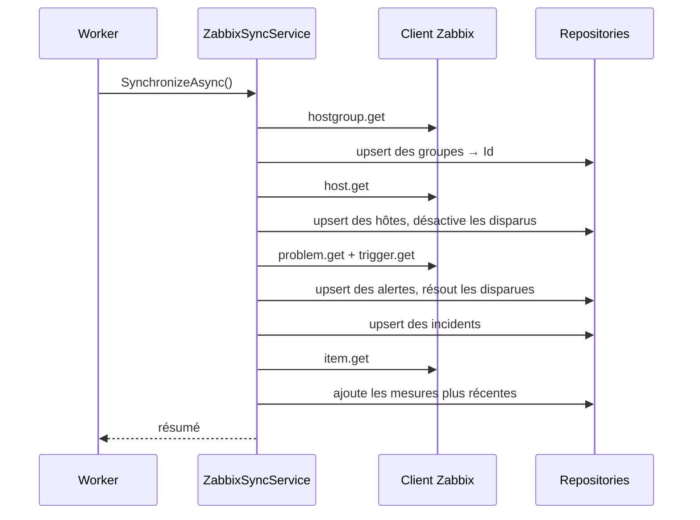

---
tags:
  - projet/csharp
  - type/archi
  - techno/zabbix
  - techno/dotnet
  - techno/efcore
  - sujet/api-tierce
  - sujet/synchronisation
  - sujet/architecture
  - statut/a-jour
aliases:
  - Synchro Zabbix
cree: 2026-09-30
maj: 2026-09-30
---

# Zabbix — synchroniser dans sa base

> [!abstract] En une phrase
> Plutôt que d'appeler Zabbix à chaque requête du front, une **tâche de fond** copie Zabbix dans notre base toutes les 60 secondes. Le front ne lit que notre base. Cette note donne le choix d'architecture, la correspondance des données, l'ordre de la synchro et la place de chaque fichier. À lire avant : [[02 Zabbix — l'API JSON-RPC]].

---

## ⚖️ Pourquoi synchroniser

Deux options ont été comparées, voir [[00 API tierces]] :



**Décision : la synchronisation.**

| Argument | Détail |
|---|---|
| Le front ne dépend pas de Zabbix | Zabbix en panne → on sert les dernières données connues |
| Moins d'appels à Zabbix | Un lot fixe toutes les 60 s, au lieu de 1 à 4 appels **par requête du front** |
| Pas de doublons | Chaque objet est retrouvé grâce à son identifiant Zabbix (upsert) |
| Plus rapide pour le front | Il lit la base locale, sans attendre le réseau |
| Un historique à nous | Les mesures sont gardées au-delà de la rétention de Zabbix |
| Coût | Jusqu'à 60 s de décalage, et du code de synchro à maintenir |

> [!warning] L'intuition trompeuse
> On pense souvent que copier crée plus de requêtes, des doublons et de la lenteur. C'est l'inverse : c'est l'**appel direct** qui multiplie les requêtes et fait attendre le front. Les doublons sont évités par l'upsert.

---

## 🔗 La correspondance des données

| Zabbix | Notre entité | Champs |
|---|---|---|
| Groupe d'hôtes | `GroupHost` | `groupid` → `ZabbixId`, `name` |
| Hôte | `Host` | `hostid` → `ZabbixId`, `name`, `description`, `status = 1` → `IsDisabled`, **premier groupe** → `GroupHostId` |
| Problème | `Alert` | `eventid` → `ZabbixId`, `objectid` → `ZabbixTriggerId`, `name` → `Subject`, `opdata` → `Message`, `severity`, `clock` → `DateTime`, `r_clock` → `ResolvedAt` |
| Acquittement | `Incident` | `acknowledgeid` → `ZabbixId`, message (ou résumé de l'action), nouvelle sévérité, date |
| Dernières valeurs CPU, RAM, disque | `HostState` | Une ligne ajoutée au plus toutes les 5 minutes par hôte |

| Décision | Pourquoi |
|---|---|
| Un hôte n'a qu'**un** groupe : on garde le premier (identifiant le plus petit) | Garder un modèle simple. Passer en plusieurs-à-plusieurs plus tard si besoin |
| Le trigger n'a pas de table, seulement `Alert.ZabbixTriggerId` | Presque gratuit, et utile pour regrouper les alertes d'une même règle ou désactiver un trigger plus tard |
| Un objet disparu n'est **jamais supprimé** | Hôte → `IsDisabled = true`, problème → `ResolvedAt`. On garde l'historique |
| Un `HostState` n'est créé que si CPU, RAM **et** disque sont connus | Ses trois colonnes sont obligatoires : mieux vaut aucune ligne qu'un faux 0 % |
| Textes tronqués à la longueur des colonnes | Un nom Zabbix peut être plus long que la colonne |

---

## 🔁 L'ordre d'une synchronisation

L'ordre suit les **clés étrangères** : impossible de relier une alerte à un hôte qui n'existe pas encore.



👉 Chaque upsert renvoie la correspondance `ZabbixId → Id` : c'est elle qui permet de remplir `GroupHostId` sur les hôtes, puis `HostId` sur les alertes, puis `AlertId` sur les incidents. Voir [[03 Synchroniser des données externes (upsert)]].

---

## 🗂️ Où ranger chaque fichier

| Projet | Fichiers |
|---|---|
| `MonApi.Zabbix` (projet-feuille) | `IZabbixClient`, `ZabbixApiClient`, `ZabbixOptions`, `ZabbixException`, `Models/`, `JsonRpc/` |
| `MonApi.Domain` | `Monitoring/Host`, `GroupHost`, `Alert`, `Incident`, `HostState`, avec leurs colonnes `ZabbixId` |
| `MonApi.EntitiesContext` | Les configurations : index unique filtré sur `ZabbixId`, index `(HostId, DateTime)`, la migration |
| `MonApi.Repository.Contracts` / `Repository` | `UpsertByZabbixIdAsync`, `DisableZabbixHostsExceptAsync`, `ResolveZabbixAlertsExceptAsync`, `AddNewerHostStatesAsync` |
| `MonApi.Application.Contracts` | `Monitoring/IZabbixSyncService`, `Monitoring/Dtos/ZabbixSyncResult` |
| `MonApi.Application` | `Monitoring/ZabbixSyncService` : lit, traduit, enregistre |
| `MonApi.Api` | `ZabbixSyncWorker` (tâche de fond), `ZabbixController` (`POST …/sync`, rôle admin) |

---

## ⚙️ Les réglages

```json
"Zabbix": {
  "Url": "",
  "ApiToken": "",
  "TimeoutSeconds": 30,
  "Sync": {
    "Enabled": true,
    "IntervalSeconds": 60,
    "HostStateIntervalSeconds": 300
  }
}
```

| Réglage | Rôle |
|---|---|
| `Url`, `ApiToken` | Vides dans le fichier versionné : ils viennent des user-secrets ou du `.env`. Sans eux, la synchro est ignorée et l'API démarre quand même |
| `IntervalSeconds` | **Toutes les combien on lit Zabbix.** À chaque passage, groupes, hôtes et alertes sont mis à jour sur place : c'est la **fraîcheur** des données |
| `HostStateIntervalSeconds` | **Toutes les combien on garde une mesure dans l'historique**, par hôte. Les mesures lues entre deux ne sont pas enregistrées : c'est la **taille** de l'historique |

> [!example] La caméra de surveillance
> Le gardien regarde l'écran **toutes les minutes** (`IntervalSeconds`) : il voit tout de suite une alarme. Mais il ne colle une **photo dans l'album** que **toutes les 5 minutes** (`HostStateIntervalSeconds`), sinon l'album devient énorme.

---

## 🌐 La route manuelle

`POST …/Zabbix/sync`, réservée au rôle admin, lance la même synchro immédiatement :

| Réponse | Quand |
|---|---|
| **200** + résumé | Synchro réussie (nombre de groupes, d'hôtes, d'alertes…) |
| **401** / **403** | Pas de token / pas admin |
| **503** + `ProblemDetails` | Zabbix non configuré, injoignable ou en erreur |

Un verrou (`SemaphoreSlim`) dans le service empêche la route et la tâche de fond de tourner en même temps.

---

## 🔗 Liens

- [[04 Tâches de fond (BackgroundService)]] — la boucle toutes les 60 s
- [[03 Synchroniser des données externes (upsert)]] — l'upsert en détail
- [[04 Zabbix — pièges et limites]] — ce qui peut mal se passer
