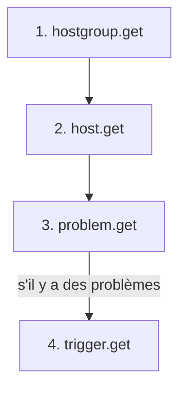

---
tags:
  - projet/csharp
  - type/reference
  - techno/zabbix
  - techno/csharp
  - sujet/api-tierce
  - sujet/supervision
  - statut/a-jour
aliases:
  - Zabbix — routes API
  - Méthodes API Zabbix
cree: 2026-10-01
maj: 2026-10-01
---

# Zabbix — les méthodes utilisées

> [!abstract] En une phrase
> La liste des **appels à l'API Zabbix** faits par la synchronisation, présentés comme dans un Swagger : la route, les headers, le corps envoyé, les réponses possibles et ce que devient chaque champ. À lire avant : [[02 Zabbix — l'API JSON-RPC]].

---

## ⚠️ Une seule route pour tout

> [!info] Pas de `/hosts` ni de `/problems`
> Une API REST classique a une route par ressource (`GET /hosts`, `GET /problems`). L'API Zabbix est en **JSON-RPC** : **toutes les méthodes passent par la même route**, toujours en `POST`. C'est le champ **`"method"`** du corps qui dit quoi faire.
>
> ```
> POST https://zabbix.example.com/api_jsonrpc.php     body → "method": "host.get"
> ```

| | Valeur |
|---|---|
| **Base URL** | `https://zabbix.example.com` (réglage `Zabbix:Url`) |
| **Route** | `POST /api_jsonrpc.php` |
| **Header** `Content-Type` | `application/json-rpc` |
| **Header** `Authorization` | `Bearer <token>` (réglage `Zabbix:ApiToken`) |

---

## 📋 Les routes utilisées

| Verbe | Route | Méthode (`"method"`) | Récupère | Alimente côté API |
|---|---|---|---|---|
| `POST` | `/api_jsonrpc.php` | `hostgroup.get` | Les groupes d'hôtes | `GET /GroupHost` |
| `POST` | `/api_jsonrpc.php` | `host.get` | Les hôtes et leurs groupes | `GET /Host` |
| `POST` | `/api_jsonrpc.php` | `problem.get` | Les alertes (problèmes actifs et récemment résolus) | `GET /Alert` |
| `POST` | `/api_jsonrpc.php` | `trigger.get` | L'hôte de chaque alerte | `GET /Alert` (le champ `hostName`) |
| `POST` | `/api_jsonrpc.php` | `apiinfo.version` | La version de Zabbix | *test uniquement, hors synchro* |

👉 Toutes en **lecture seule** (`.get`). Ordre d'appel à chaque synchro (toutes les 60 s) :



---

## 🟢 POST /api_jsonrpc.php — `hostgroup.get`

> **Récupère les groupes qui contiennent au moins un hôte.**

**Corps de la requête**

```json
{
  "jsonrpc": "2.0",
  "method": "hostgroup.get",
  "params": {
    "output": ["groupid", "name"],
    "with_hosts": true
  },
  "id": 1
}
```

| Paramètre | Type | Valeur envoyée | Rôle |
|---|---|---|---|
| `output` | `string[]` | `["groupid", "name"]` | Les champs à renvoyer |
| `with_hosts` | `bool` | `true` | Seulement les groupes qui contiennent des hôtes |

**Réponse `200`**

```json
{
  "jsonrpc": "2.0",
  "result": [
    { "groupid": "2", "name": "Linux servers" },
    { "groupid": "6", "name": "Virtual machines" }
  ],
  "id": 1
}
```

| Champ | Type | Devient |
|---|---|---|
| `groupid` | `string` | `GroupHost.ExternalId` |
| `name` | `string` | `GroupHost.Name` |

---

## 🟢 POST /api_jsonrpc.php — `host.get`

> **Récupère tous les hôtes, y compris les désactivés, avec leurs groupes.**

**Corps de la requête**

```json
{
  "jsonrpc": "2.0",
  "method": "host.get",
  "params": {
    "output": ["hostid", "name", "status", "description"],
    "selectHostGroups": ["groupid"]
  },
  "id": 2
}
```

| Paramètre | Type | Valeur envoyée | Rôle |
|---|---|---|---|
| `output` | `string[]` | `["hostid", "name", "status", "description"]` | Les champs à renvoyer |
| `selectHostGroups` | `string[]` | `["groupid"]` | Ajoute les groupes de chaque hôte. ⚠️ `selectHostGroups` depuis Zabbix 6.2 (l'ancien `selectGroups` n'existe plus) |

**Réponse `200`**

```json
{
  "jsonrpc": "2.0",
  "result": [
    {
      "hostid": "10084",
      "name": "srv-web-01",
      "status": "0",
      "description": "Serveur web principal",
      "hostgroups": [ { "groupid": "2" }, { "groupid": "6" } ]
    }
  ],
  "id": 2
}
```

| Champ | Type | Devient |
|---|---|---|
| `hostid` | `string` | `Host.ExternalId` |
| `name` | `string` | `Host.Name` (le nom visible) |
| `description` | `string` | `Host.Description` |
| `status` | `string` (`"0"` / `"1"`) | `Host.IsDisabled` : `"0"` = surveillé, `"1"` = désactivé |
| `hostgroups[].groupid` | `string[]` | `Host.GroupHostId` : le **premier** groupe (le plus petit `groupid`) |

---

## 🟢 POST /api_jsonrpc.php — `problem.get`

> **Récupère les problèmes actifs et ceux résolus récemment.**

**Corps de la requête**

```json
{
  "jsonrpc": "2.0",
  "method": "problem.get",
  "params": {
    "output": ["eventid", "objectid", "name", "severity", "clock", "r_clock", "opdata"],
    "recent": true,
    "sortfield": ["eventid"],
    "sortorder": "ASC"
  },
  "id": 3
}
```

| Paramètre | Type | Valeur envoyée | Rôle |
|---|---|---|---|
| `output` | `string[]` | `["eventid", "objectid", …]` | Les champs à renvoyer |
| `recent` | `bool` | `true` | Ajoute les problèmes **résolus récemment**, pour connaître leur date de résolution |
| `sortfield` | `string[]` | `["eventid"]` | Trier par identifiant… |
| `sortorder` | `string` | `"ASC"` | …du plus ancien au plus récent |

**Réponse `200`**

```json
{
  "jsonrpc": "2.0",
  "result": [
    {
      "eventid": "867",
      "objectid": "25539",
      "name": "Espace disque critique sur /",
      "severity": "4",
      "clock": "1790676802",
      "r_clock": "0",
      "opdata": ""
    }
  ],
  "id": 3
}
```

| Champ | Type | Devient |
|---|---|---|
| `eventid` | `string` | `Alert.ExternalId` |
| `name` | `string` | `Alert.Subject` |
| `opdata` | `string` | `Alert.Message` (souvent vide) |
| `severity` | `string` (`"0"` à `"5"`) | `Alert.Severity` |
| `clock` | `string` (secondes depuis 1970) | `Alert.DateTime` |
| `r_clock` | `string` (secondes, `"0"` si actif) | `Alert.ResolvedAt` (`null` tant que le problème est actif) |
| `objectid` | `string` | L'identifiant du **trigger** → envoyé à `trigger.get` |

> [!warning] Pas d'hôte dans la réponse
> `problem.get` ne dit pas **quelle machine** est concernée : d'où l'appel suivant.

---

## 🟢 POST /api_jsonrpc.php — `trigger.get`

> **Retrouve l'hôte de chaque problème.** Un seul appel pour tous les problèmes, et aucun appel s'il n'y a pas de problème.

**Corps de la requête**

```json
{
  "jsonrpc": "2.0",
  "method": "trigger.get",
  "params": {
    "triggerids": ["25539", "25540"],
    "output": ["triggerid"],
    "selectHosts": ["hostid"]
  },
  "id": 4
}
```

| Paramètre | Type | Valeur envoyée | Rôle |
|---|---|---|---|
| `triggerids` | `string[]` | Les `objectid` des problèmes, **sans doublon** | Les triggers à lire |
| `output` | `string[]` | `["triggerid"]` | Seul l'identifiant est utile |
| `selectHosts` | `string[]` | `["hostid"]` | Ajoute l'hôte surveillé par chaque trigger |

**Réponse `200`**

```json
{
  "jsonrpc": "2.0",
  "result": [
    { "triggerid": "25539", "hosts": [ { "hostid": "10084" } ] }
  ],
  "id": 4
}
```

| Champ | Type | Devient |
|---|---|---|
| `hosts[0].hostid` | `string` | `Alert.HostId` (l'Id en base de l'hôte qui a cet `ExternalId`) |

👉 Un trigger introuvable ne bloque pas la synchro : l'alerte est enregistrée **sans hôte**.

---

## 🧪 POST /api_jsonrpc.php — `apiinfo.version`

> **Renvoie la version de Zabbix.** Pas utilisée par la synchro : sert à vérifier que l'URL est bonne. **Sans header `Authorization`** (Zabbix refuse cette méthode avec un token).

```json
{ "jsonrpc": "2.0", "method": "apiinfo.version", "params": {}, "id": 1 }
```

**Réponse `200`**

```json
{ "jsonrpc": "2.0", "result": "7.0.30", "id": 1 }
```

```bash
curl -s -X POST https://zabbix.example.com/api_jsonrpc.php \
  -H "Content-Type: application/json-rpc" \
  -d '{"jsonrpc":"2.0","method":"apiinfo.version","params":{},"id":1}'
```

---

## 🔴 Les réponses d'erreur (toutes les routes)

> [!warning] Une erreur revient avec un HTTP **200**
> Zabbix répond `200 OK` même quand l'appel échoue : c'est le champ **`error`** à la place de `result` qui le signale.

```json
{
  "jsonrpc": "2.0",
  "error": {
    "code": -32602,
    "message": "Invalid params.",
    "data": "Not authorised."
  },
  "id": 2
}
```

| Cas | Ce qu'on reçoit | Ce que fait le client |
|---|---|---|
| Token faux ou sans droits | `200` + `error` (`Not authorised.`) | `ZabbixException` avec le message |
| Paramètre inconnu | `200` + `error` (`Invalid parameter …`) | `ZabbixException` |
| Droits insuffisants sur un groupe | `200` + `result: []` (**liste vide, pas d'erreur**) | Rien ne le signale, voir [[04 Zabbix — pièges et limites]] |
| Serveur en panne | `5xx` ou pas de réponse | `ZabbixException` |

---

## 🔒 Droits nécessaires

L'utilisateur du token n'a besoin que de la **lecture** sur les groupes d'hôtes à synchroniser.

---

## 🔗 Liens

- [[02 Zabbix — l'API JSON-RPC]] — le format JSON-RPC et le client C#
- [[03 Zabbix — synchroniser dans sa base]] — ce que la synchro fait de ces données
- [[04 Zabbix — pièges et limites]] — les erreurs fréquentes
