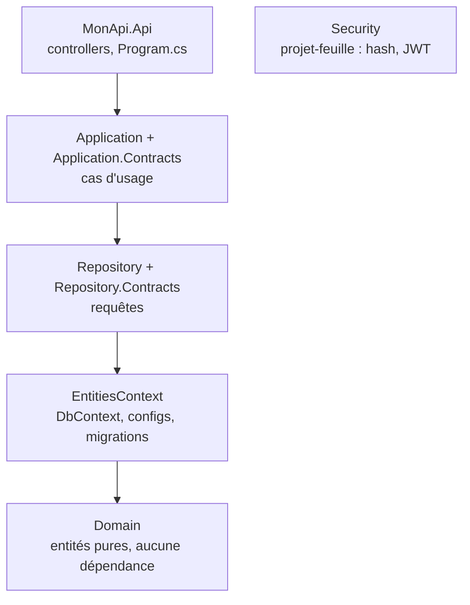

---
tags:
  - projet/csharp
  - type/index
  - techno/csharp
  - techno/dotnet
  - sujet/architecture
  - statut/a-jour
aliases:
  - CSharp — architecture
cree: 2026-09-30
maj: 2026-09-30
---

# Architecture .NET

> [!abstract] En une phrase
> Une API .NET propre est **découpée en plusieurs projets** dans une même solution, chacun avec un seul rôle. La règle d'or : **une flèche ne remonte jamais**, c'est-à-dire qu'une couche basse ne connaît jamais une couche haute.

---

## 🧩 La solution de référence

La solution d'exemple `MonApi` contient **8 projets** :

*(Schéma simplifié en colonne. En réalité, `Application` et `Repository` dépendent aussi directement de `Domain`, et `Application` utilise `Security`.)*

> [!example] L'immeuble
> Le **Domain** est la fondation : il ne s'appuie sur rien. Chaque étage repose sur ceux du dessous, jamais l'inverse. On peut refaire un étage (changer de base de données) sans toucher aux fondations.

---

## 📚 Notes de la section

| Note | Contenu |
|---|---|
| [[01 Clean architecture en couches]] | Le rôle de chaque projet, les `.Contracts`, le projet-feuille, les conventions |
| [[02 Injection de dépendances en .NET]] | Un `DependencyInjection.cs` par couche, un `Program.cs` court |
| [[03 Résultat d'un cas d'usage (Result)]] | Renvoyer un succès ou un code d'erreur métier |

---

## 🔗 Liens

- [[csharp]] — accueil du vault
- [[00 API tierces]] — où brancher un service externe dans cette architecture
