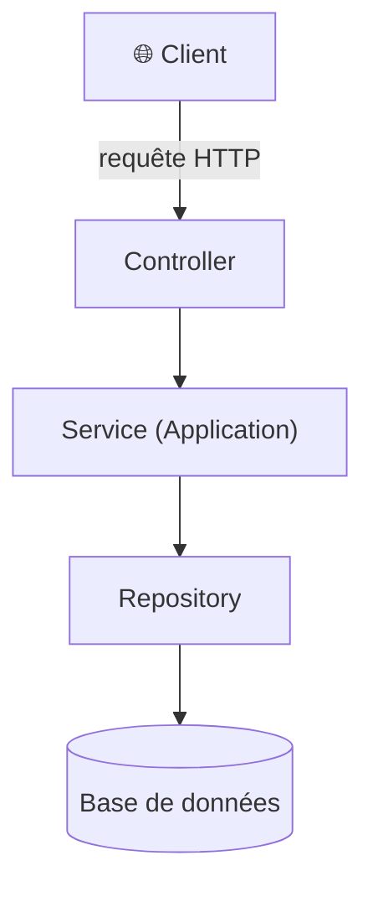

---
tags:
  - projet/csharp
  - type/index
  - techno/csharp
  - techno/dotnet
  - statut/a-jour
aliases:
  - CSharp — ASP.NET Core
cree: 2026-09-30
maj: 2026-09-30
---

# ASP.NET Core

> [!abstract] En une phrase
> **ASP.NET Core** est le framework de .NET pour faire des **API web** : il reçoit les requêtes HTTP, les envoie au bon **controller** et renvoie la réponse, souvent en JSON.

---

## 🍽️ La métaphore : le restaurant

> [!example] Une API = un restaurant
> - Le **client** (le front, un outil de test) passe commande : c'est la **requête HTTP**.
> - Le **serveur en salle** prend la commande : c'est le **controller**.
> - La **cuisine** prépare le plat : ce sont les **services** et les **repositories**.
> - Le **frigo**, c'est la **base de données**.
> - Le **manager** qui ouvre le restaurant le matin, c'est **`Program.cs`**.

---

## 🧩 Les mots à connaître

| Mot | Ce que ça veut dire |
|---|---|
| **`Program.cs`** | Le point de départ : on enregistre les services, on construit l'appli, on la démarre |
| **Hôte** (*host*) | Le moteur qui fait tourner l'appli : serveur web, configuration, logs, tâches de fond |
| **Controller** | Une classe qui regroupe des routes (`POST api/auth/login`) |
| **Middleware** | Une étape traversée par chaque requête (HTTPS, authentification…) |
| **Environnement** | Le « mode » de l'appli : `Development`, `Production`… |
| **OpenAPI** | La description JSON des routes de l'API (`/openapi/v1.json`) |
| **Scalar** / **Swagger UI** | Une page web pour tester les routes à la main, à activer **en dev seulement** |
| **Tâche de fond** (*hosted service*) | Un traitement qui tourne tout seul, à côté des requêtes |

> [!info] OpenAPI sans interface
> Depuis .NET 9, `AddOpenApi()` ne génère **que le JSON**, sans page web. On ajoute **Scalar** (`Scalar.AspNetCore`, URL `/scalar/v1`) ou **Swagger UI** (`Swashbuckle.AspNetCore`) pour avoir une interface cliquable.

---

## 📚 Notes de la section

| Note | Contenu |
|---|---|
| [[01 Configuration et environnements]] | Les fichiers `appsettings`, l'ordre de priorité, le pattern Options |
| [[02 Garder les secrets hors du repo]] | Où ranger une clé ou un token pour qu'il ne parte jamais sur git |
| [[03 launchSettings et profils de lancement]] | Le fichier qui choisit l'environnement quand on lance depuis l'IDE |
| [[04 Tâches de fond (BackgroundService)]] | Lancer un traitement toutes les N secondes |

---

## 🔗 Liens

- [[csharp]] — accueil du vault
- [[02 Injection de dépendances en .NET]] — ce que fait `Program.cs`
