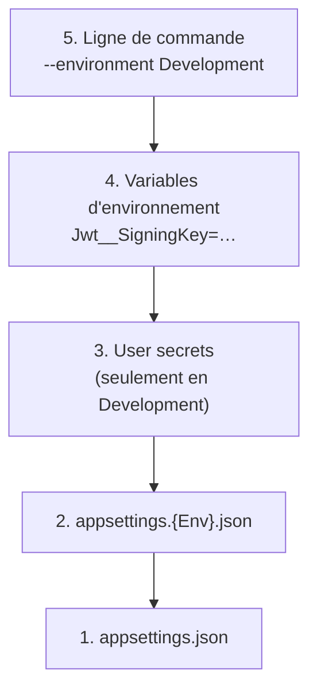

---
tags:
  - projet/csharp
  - type/concept
  - techno/csharp
  - techno/dotnet
  - sujet/configuration
  - statut/a-jour
aliases:
  - appsettings et environnements
cree: 2026-09-30
maj: 2026-09-30
---

# Configuration et environnements

> [!abstract] En une phrase
> Une API .NET lit ses réglages dans **plusieurs sources empilées** (fichiers `appsettings`, user-secrets, variables d'environnement…). La source la plus haute gagne, et l'**environnement** choisit quel fichier `appsettings.{Env}.json` est lu en plus. À lire avant : [[00 ASP.NET Core]].

---

## 🧩 Les fichiers appsettings

.NET lit **toujours** `appsettings.json`, puis **un seul** fichier en plus : celui qui porte le nom de l'**environnement**.

| Fichier | Lu quand | Contenu |
|---|---|---|
| `appsettings.json` | Toujours | Les réglages communs, **sans aucun secret**. Versionné |
| `appsettings.Development.json` | Environnement `Development` | Les réglages de dev (niveau de logs…) |
| `appsettings.Production.json` | Environnement `Production` | Les réglages de prod |

Exemple de `appsettings.json` versionné : la **clé** de signature JWT n'y est pas, elle arrive par les user-secrets.

```json
"Jwt": {
  "Issuer": "monapi",
  "Audience": "monapi-clients",
  "ExpirationMinutes": 60
}
```

> [!info] Définition — environnement
> L'**environnement** est un simple nom, donné par la variable **`ASPNETCORE_ENVIRONMENT`**. Les noms standards sont `Development`, `Staging` et `Production`, mais le nom est libre (`Docker`, `Local`…). Dans le code : `app.Environment.IsDevelopment()` ou `IsEnvironment("Docker")`.

> [!warning] Un environnement perso a des effets de bord
> `IsDevelopment()` ne reconnaît **que** `Development`. Si on invente un environnement `Local`, tout ce qui est protégé par `IsDevelopment()` (page de test, données de démo…) ne s'exécute plus, et les **user-secrets ne sont plus chargés**. Préférer `Development` pour le poste du développeur.

---

## 🥞 L'ordre de priorité

Les sources sont empilées comme des **calques** : une valeur définie plus haut **écrase** celle d'en dessous.



> [!tip] Le double underscore `__`
> Dans une variable d'environnement, **`__` remplace le niveau d'imbrication du JSON** : `Jwt__SigningKey` correspond à `{ "Jwt": { "SigningKey": … } }`. C'est ainsi qu'on passe la config à un conteneur Docker.

> [!warning] Les listes se fusionnent par index
> Si `appsettings.json` contient une liste de 3 éléments et un autre fichier une liste de 1, seul **l'élément 0** est remplacé : les éléments 1 et 2 restent.

---

## 🧰 Lire la config : le pattern Options

On **range une section de la config dans une classe** : c'est le **pattern Options**. La classe déclare elle-même le nom de sa section.

```csharp
// Security/Tokens/JwtOptions.cs
public class JwtOptions
{
    public const string SectionName = "Jwt";

    public string Issuer { get; set; } = string.Empty;
    public string Audience { get; set; } = string.Empty;
    public string SigningKey { get; set; } = string.Empty;   // jamais versionnée
    public int ExpirationMinutes { get; set; } = 60;
}
```

Enregistrement, dans le `DependencyInjection.cs` de la couche :

```csharp
services.Configure<JwtOptions>(configuration.GetSection(JwtOptions.SectionName));
```

Pour aller plus loin et **valider au démarrage** :

```csharp
services.AddOptions<ZabbixSyncOptions>()
    .Bind(configuration.GetSection(ZabbixSyncOptions.SectionName))
    .ValidateDataAnnotations()
    .ValidateOnStart();
```

| Code | Pourquoi |
|---|---|
| `SectionName` dans la classe | Le nom de la section est écrit une seule fois, au même endroit que ses propriétés |
| `.Bind(…)` | Copie la section JSON dans les propriétés de la classe |
| `.ValidateDataAnnotations()` | Vérifie les attributs comme `[Range(10, 86400)]` |
| `.ValidateOnStart()` | L'appli plante **au démarrage** si la config est fausse : fail-fast |

Une classe reçoit ensuite les réglages par son constructeur, avec `IOptions<JwtOptions> options` puis `options.Value`.

> [!tip] Ne pas exiger ce qui peut manquer
> Un réglage facultatif (le token d'une API tierce qu'un coéquipier n'a pas) ne doit pas faire planter l'appli : on ne valide que sa **forme**, et la fonctionnalité se désactive si elle manque.

---

## 🔗 Liens

- [[02 Garder les secrets hors du repo]] — où mettre ce qui ne doit pas être versionné
- [[03 launchSettings et profils de lancement]] — où l'environnement est choisi
- [[01 Docker Compose — base de données et API]] — la config passée par variables d'environnement
