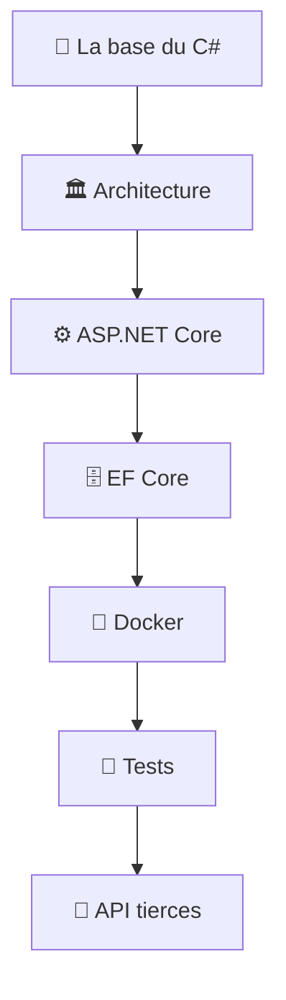

---
tags:
  - projet/csharp
  - type/index
  - techno/csharp
  - techno/dotnet
  - statut/a-jour
aliases:
  - CSharp / .NET — MOC
  - Accueil CSharp
cree: 2026-09-30
maj: 2026-09-30
---

# 🗂️ C# / .NET — MOC

> [!abstract] Map of Content
> Page d'accueil de la doc **C# / .NET** : construire une API web propre, de l'architecture jusqu'au lancement dans Docker, et brancher des **API tierces**. Les exemples utilisent une solution fictive appelée **`MonApi`**.

---

## 🧱 La base du C#

- [[00 Le langage CSharp]] — le langage lui-même *(section à remplir)*

---

## 🏛️ Architecture

- [[00 Architecture .NET]] — une solution découpée en projets, la règle « une flèche ne remonte jamais »
- [[01 Clean architecture en couches]] — le rôle de chaque projet, les `.Contracts`, le projet-feuille
- [[02 Injection de dépendances en .NET]] — un `DependencyInjection.cs` par couche, les durées de vie
- [[03 Résultat d'un cas d'usage (Result)]] — renvoyer un succès ou un code d'erreur, sans `null` ni exception

---

## ⚙️ ASP.NET Core

- [[00 ASP.NET Core]] — `Program.cs`, controllers, les mots à connaître
- [[01 Configuration et environnements]] — `appsettings`, l'ordre de priorité, le pattern Options
- [[02 Garder les secrets hors du repo]] — user-secrets, `.gitignore`, `.dockerignore`, `.env`
- [[03 launchSettings et profils de lancement]] — qui lit ce fichier, et qui ne le lit pas
- [[04 Tâches de fond (BackgroundService)]] — un traitement qui tourne toutes les N secondes

---

## 🗄️ EF Core

- [[00 EF Core]] — l'ORM : `DbContext`, `DbSet`, suivi des changements
- [[01 Configurer les entités (IEntityTypeConfiguration)]] — une classe de config par entité
- [[02 Migrations et dotnet ef]] — les commandes et les erreurs fréquentes
- [[03 Synchroniser des données externes (upsert)]] — importer des données sans doublon

---

## 🐳 Docker

- [[00 Docker et .NET]] — image, conteneur, `Dockerfile` ou `docker-compose.yml`
- [[01 Docker Compose — base de données et API]] — la base seule, puis la base et l'API ensemble

---

## 🧪 Tests

- [[00 Tests .NET]] — NUnit, Moq, les conventions de nommage
- [[01 Tester sans dépendances externes]] — faux repositories, base en mémoire, faux serveur HTTP

---

## 🧰 Outils

- [[00 Outils .NET]] — les outils du quotidien
- [[01 Rider — lancer l'API en local ou dans Docker]] — les configurations de lancement

---

## 🔌 API tierces

- [[00 API tierces]] — brancher un service externe : projet-feuille, client HTTP typé, appel direct ou synchronisation

### Zabbix

- [[00 Zabbix]] — l'outil de supervision et ce qu'on en récupère
- [[01 Zabbix — les concepts]] — groupe, hôte, item, trigger, problème, acquittement
- [[02 Zabbix — l'API JSON-RPC]] — s'authentifier, appeler les méthodes, les pièges
- [[03 Zabbix — synchroniser dans sa base]] — le choix d'architecture et la correspondance des données
- [[04 Zabbix — pièges et limites]] — faux positifs, métriques incomplètes, erreurs fréquentes

---

## 🧭 Parcours conseillé

---

## 🏷️ Tags du vault

Chaque note a au moins `#projet/csharp`, un `#type/…` et un `#statut/…`.

| Famille | Tags utilisés ici |
|---|---|
| `techno/` | `#techno/csharp` `#techno/dotnet` `#techno/efcore` `#techno/docker` `#techno/sqlserver` `#techno/mariadb` `#techno/zabbix` `#techno/rider` `#techno/nunit` `#techno/git` |
| `sujet/` | `#sujet/architecture` `#sujet/injection-de-dependances` `#sujet/configuration` `#sujet/securite` `#sujet/base-de-donnees` `#sujet/api-tierce` `#sujet/supervision` `#sujet/synchronisation` `#sujet/tests` `#sujet/debug` `#sujet/build` |
| `type/` | `#type/index` `#type/concept` `#type/guide` `#type/reference` `#type/decision` `#type/archi` `#type/setup` |
| `statut/` | `#statut/a-jour` `#statut/brouillon` |
