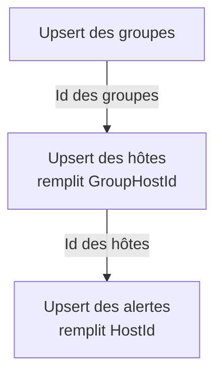

---
tags:
  - projet/csharp
  - type/concept
  - techno/csharp
  - techno/efcore
  - sujet/base-de-donnees
  - sujet/synchronisation
  - sujet/api-tierce
  - statut/a-jour
aliases:
  - Upsert EF Core
  - Upsert
  - Identifiant externe
  - ExternalId
cree: 2026-09-30
maj: 2026-10-01
---

# Synchroniser des données externes (upsert)

> [!abstract] En une phrase
> Pour copier régulièrement les données d'un autre système sans créer de doublons, on garde **l'identifiant de l'autre système** dans une colonne `ExternalId`, et on fait un **upsert** : on **met à jour** la ligne si elle existe, on l'**insère** sinon. À lire avant : [[01 Configurer les entités (IEntityTypeConfiguration)]].

---

## 🧩 C'est quoi un upsert

> [!info] Définition
> **Upsert = UPdate + inSERT.** Pour chaque objet reçu : s'il existe déjà en base, on le met à jour ; sinon, on le crée.

> [!example] Le carnet d'adresses
> Un ami te redonne son numéro. Tu ne crées pas une deuxième fiche à son nom : tu cherches sa fiche, tu corriges le numéro. S'il n'a pas encore de fiche, tu en crées une. C'est un upsert.

Le système externe renvoie à chaque fois sa **liste complète**. Sans upsert, il n'y a que deux mauvaises options :

| Option | Problème |
|---|---|
| Tout **insérer** à chaque fois | Au bout de 10 synchros, chaque objet existe 10 fois |
| Tout **supprimer** puis réinsérer | Les `Id` changent à chaque fois : les liens entre tables cassent et l'historique est perdu |
| **Upsert** | La même ligne garde le même `Id`, seules ses valeurs changent |

---

## 🔑 L'identifiant externe

Pour savoir si « c'est le même objet », on ne peut pas se fier au nom : il peut changer. On compare sur l'**identifiant de l'objet dans le système externe**, qui ne change jamais.

Chaque entité importée a donc deux identifiants :

| Colonne | Qui la donne | Exemple |
|---|---|---|
| `Id` | Notre base, à l'insertion | `1004` |
| `ExternalId` (`string?`) | Le système externe | `"10693"` |

> [!info] Pourquoi `string?`
> - **`string`** : beaucoup d'API renvoient leurs identifiants en texte. Les garder tels quels évite toute conversion.
> - **`?` (nullable)** : une donnée créée à la main dans notre appli n'a pas d'identifiant externe. `null` veut dire « pas importée ».

> [!tip] Un nom neutre, pas le nom du fournisseur
> On écrit `ExternalId`, pas `ZabbixId` ni `StripeId`. Les entités et les repositories ne doivent pas connaître le nom de l'outil : seul le service qui parle à cet outil le connaît. Le jour où la source change, il n'y a rien à renommer dans les couches basses.

---

## 🔒 L'index unique filtré

Dans la classe de configuration de l'entité :

```csharp
builder.Property(h => h.ExternalId).HasMaxLength(32);
builder.HasIndex(h => h.ExternalId).IsUnique().HasFilter("[ExternalId] IS NOT NULL");
```

| Code | Pourquoi |
|---|---|
| `HasMaxLength(32)` | Une colonne de texte illimitée ne peut pas être indexée |
| `IsUnique()` | La base **refuse** deux lignes avec le même identifiant externe : le dernier filet contre les doublons |
| `HasFilter("[ExternalId] IS NOT NULL")` | Sous SQL Server, deux `NULL` comptent comme égaux : sans filtre, on ne pourrait créer qu'**une seule** donnée manuelle. La syntaxe du filtre dépend de la base |

---

## 📜 Un contrat commun : `IExternalEntity`

Plusieurs entités sont importées (hôtes, groupes, alertes…). Pour écrire l'upsert **une seule fois** pour toutes, on leur donne un contrat commun :

```csharp
public interface IExternalEntity
{
    int Id { get; }
    string? ExternalId { get; }
}
```

```csharp
public class Host : IExternalEntity
{
    public int Id { get; set; }
    public string? ExternalId { get; set; }
    public string Name { get; set; } = string.Empty;
}
```

| Code | Pourquoi |
|---|---|
| `interface IExternalEntity` | Un contrat : « tout ce qui me porte a un `Id` et un `ExternalId` » |
| `Host : IExternalEntity` | L'entité signe le contrat. Elle a déjà les deux propriétés, il n'y a rien d'autre à écrire |

👉 Une interface n'est pas une table : EF Core l'ignore, la base ne change pas.

---

## 🔁 L'upsert, écrit une seule fois

La méthode est **générique** : `TEntity` peut être n'importe quelle entité qui porte `IExternalEntity`.

```csharp
private async Task<IReadOnlyDictionary<string, int>> UpsertAsync<TEntity>(
    IReadOnlyCollection<TEntity> entities,
    string paramName,
    Action<TEntity, TEntity> copyImportedValues)
    where TEntity : class, IExternalEntity
{
    string[] externalIds = GetExternalIds(entities, paramName);
    Dictionary<string, TEntity> savedEntities = await this._context.Set<TEntity>()
        .Where(entity => entity.ExternalId != null && externalIds.Contains(entity.ExternalId))
        .ToDictionaryAsync(entity => entity.ExternalId!);

    foreach (TEntity entity in entities)
    {
        if (savedEntities.TryGetValue(entity.ExternalId!, out TEntity? savedEntity))
        {
            copyImportedValues(entity, savedEntity);          // existe déjà → mise à jour
        }
        else
        {
            _ = this._context.Set<TEntity>().Add(entity);     // nouveau → insertion
            savedEntities.Add(entity.ExternalId!, entity);
        }
    }

    _ = await this._context.SaveChangesAsync();
    return savedEntities.ToDictionary(pair => pair.Key, pair => pair.Value.Id);
}
```

| Code | Pourquoi |
|---|---|
| `where TEntity : class, IExternalEntity` | Sans cette contrainte, le compilateur ne sait pas que `TEntity` a un `ExternalId` et un `Id` : le code ne compile pas |
| `GetExternalIds(…)` | Vérifie que chaque élément a un identifiant externe, sans doublon, sinon `ArgumentException` |
| `this._context.Set<TEntity>()` | La table de l'entité, quel que soit son type (équivaut à `_context.Hosts` pour un `Host`) |
| `Where(… externalIds.Contains(…))` | **Une seule requête** (`WHERE ExternalId IN (…)`) pour charger toutes les lignes existantes |
| `ToDictionaryAsync(…)` | Retrouver une ligne par son identifiant externe instantanément |
| `copyImportedValues(entity, savedEntity)` | La seule partie qui change d'une entité à l'autre : **quels champs recopier**. EF suit l'objet chargé, modifier ses propriétés suffit, pas besoin d'écrire un `UPDATE` |
| `Add(…)` | Marque l'objet « à insérer » |
| `SaveChangesAsync()` une seule fois | Tous les `UPDATE` et `INSERT` partent ensemble. La base attribue les `Id` des nouvelles lignes, et EF les recopie dans les objets |
| `return … pair.Value.Id` | Renvoie la correspondance `identifiant externe → Id`, pour relier la suite |

> [!success] Idempotent
> Lancer la synchro une fois ou dix fois donne **le même résultat** : l'opération est **idempotente**.

---

## 🗂️ Un repository dédié à l'import

Les méthodes d'import ne vont **pas** dans les repositories du quotidien (`HostRepository`, `AlertRepository`…). Elles sont regroupées dans un repository à part :

```csharp
public interface IExternalSyncRepository
{
    Task<IReadOnlyDictionary<string, int>> UpsertGroupHostsAsync(IReadOnlyCollection<GroupHost> groupHosts);
    Task<IReadOnlyDictionary<string, int>> UpsertHostsAsync(IReadOnlyCollection<Host> hosts);
    Task<IReadOnlyDictionary<string, int>> UpsertAlertsAsync(IReadOnlyCollection<Alert> alerts);
    Task<int> DisableHostsExceptAsync(IReadOnlyCollection<string> externalIds);
    Task<int> ResolveAlertsExceptAsync(IReadOnlyCollection<string> externalIds, DateTime resolvedAt);
}
```

Chaque méthode publique ne dit que **quels champs recopier**, la boucle reste dans `UpsertAsync` :

```csharp
public Task<IReadOnlyDictionary<string, int>> UpsertHostsAsync(IReadOnlyCollection<Host> hosts)
{
    return this.UpsertAsync(hosts, nameof(hosts), (source, target) =>
    {
        target.Name = source.Name;
        target.Description = source.Description;
        target.IsDisabled = source.IsDisabled;
        target.GroupHostId = source.GroupHostId;
    });
}
```

| Choix | Pourquoi |
|---|---|
| Un repository à part | Les repositories du quotidien ne font que lire, créer, modifier, supprimer. Ils ne traînent pas des méthodes qui ne servent qu'à la synchro |
| Une seule boucle | Avant, la même boucle était copiée dans chaque repository. Un bug corrigé à un endroit restait dans les autres |
| Le service d'import ne reçoit qu'**un** repository | Au lieu d'un par entité |

Le service qui parle au système externe est le seul à savoir d'où vient l'identifiant :

```csharp
return new Host
{
    ExternalId = host.ZabbixId,   // ici, la source est Zabbix
    Name = host.Name
};
```

---

## 🔗 À quoi sert le dictionnaire renvoyé

Chaque upsert renvoie la correspondance **identifiant externe → `Id` en base**, par exemple `"10084" → 7`. L'étape suivante s'en sert pour remplir les **clés étrangères** :



👉 C'est pour ça que l'ordre est imposé : impossible de relier une alerte à un hôte qui n'existe pas encore.

---

## 🗃️ Ne rien supprimer

L'upsert ne touche pas aux lignes **absentes** de la liste reçue. Quand un objet disparaît du système externe, on **ne supprime pas** la ligne, pour garder l'historique :

| Objet disparu | Méthode | Ce qu'elle fait |
|---|---|---|
| Une machine surveillée | `DisableHostsExceptAsync` | `IsDisabled = true` |
| Une alerte | `ResolveAlertsExceptAsync` | `ResolvedAt = date de la synchro` |

Ces deux méthodes ne visent que les lignes qui ont un `ExternalId` : une donnée créée à la main n'est jamais touchée.

---

## ⚠️ Les limites de la base InMemory (tests)

| En vraie base | Avec EF Core InMemory |
|---|---|
| `ExecuteUpdateAsync()` (mise à jour en masse) | ❌ Non supporté : charger les lignes puis les modifier |
| Index unique, filtre `HasFilter` | ⚠️ Ignorés : un test InMemory ne détecte pas un doublon |

> [!tip] Vérifier aussi sur une vraie base
> Lancer l'API sur une **base jetable**, modifier une ligne importée à la main, puis attendre la synchro suivante : la valeur d'origine doit revenir, et le nombre de lignes ne doit pas bouger.

---

## 🔗 Liens

- [[03 Zabbix — synchroniser dans sa base]] — un exemple complet
- [[04 Repository classique ou repository EF]] — ce qu'est un repository
- [[00 API tierces]] — appel direct ou synchronisation
- [[01 Tester sans dépendances externes]] — tester ces repositories avec InMemory
