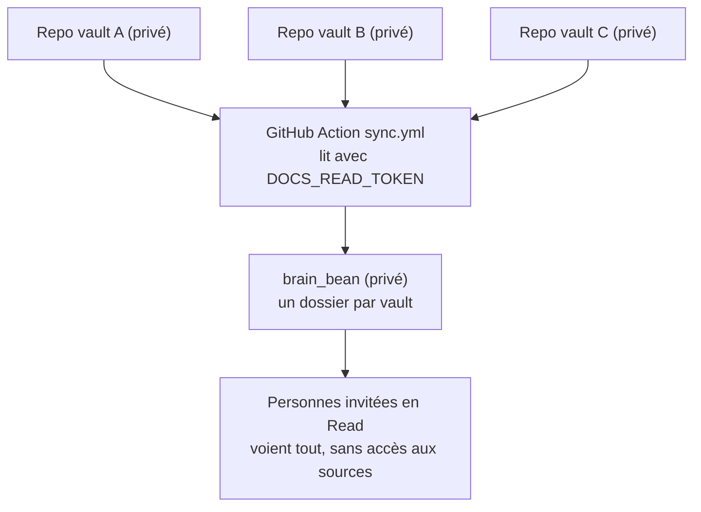

---
tags:
  - projet/brain-bean
  - type/guide
  - techno/git
  - techno/github-actions
  - statut/a-jour
cree: 2026-09-28
maj: 2026-09-28
---

# Comment ça marche

Ce qui se passe entre tes vaults et brain_bean, étape par étape.

---

## Le principe

Chaque projet a **son propre vault** dans **son propre repo GitHub**, souvent privé. brain_bean n'est pas un lien vers ces repos : c'est une **vraie copie** de leur contenu.

Pourquoi une copie ? Pour qu'une personne qui n'a accès **qu'à brain_bean** puisse tout lire, sans avoir accès aux repos d'origine. Avec des **submodules** Git (des liens vers d'autres repos), elle aurait eu besoin d'un accès à chaque repo privé.

---

## La synchro, étape par étape

Le fichier `.github/workflows/sync.yml` est une **GitHub Action** : un script que GitHub lance tout seul sur ses serveurs.

1. **Quand ?** Toutes les 6 h, quand on clique sur **Actions → Sync vaults → Run workflow**, et à chaque modification de `repos.txt`.
2. **Elle lit `repos.txt`**, où chaque ligne est un vault à copier.
3. **Pour chaque vault**, elle clone le repo avec le token, vide le dossier de destination, puis y copie le contenu.
4. **Elle nettoie** en retirant `.git/`, `.obsidian/`, `.claude/` et les `CLAUDE.md`.
5. **Elle commite et pushe** dans brain_bean, sous le nom `vault-sync`, seulement s'il y a eu des changements.

---

## Le token `DOCS_READ_TOKEN`

brain_bean a besoin d'une clé pour lire tes repos privés. C'est un **fine-grained token** GitHub :

| Réglage | Valeur |
|---|---|
| Repository access | Seulement tes repos de doc |
| Permission | `Contents : Read-only` |
| Rangé où | brain_bean → **Settings → Secrets and variables → Actions** |

> ⚠️ **Le token expire.** Note-toi la date d'expiration. Quand il expire, la synchro échoue (croix rouge dans **Actions**) : il faut en générer un nouveau et remplacer le secret.

---

## Qui voit quoi

| Qui | Voit |
|---|---|
| Toi | Tout : les repos sources et brain_bean |
| Une personne invitée sur brain_bean | Toute la doc copiée, mais **aucun** repo source |
| Le reste du monde | Rien, **tant que brain_bean est privé** |

---

## Voir aussi
- [[03-ajouter-un-vault]] — ajouter un repo à la synchro
- [[01-demarrer]] — ouvrir brain_bean dans Obsidian
